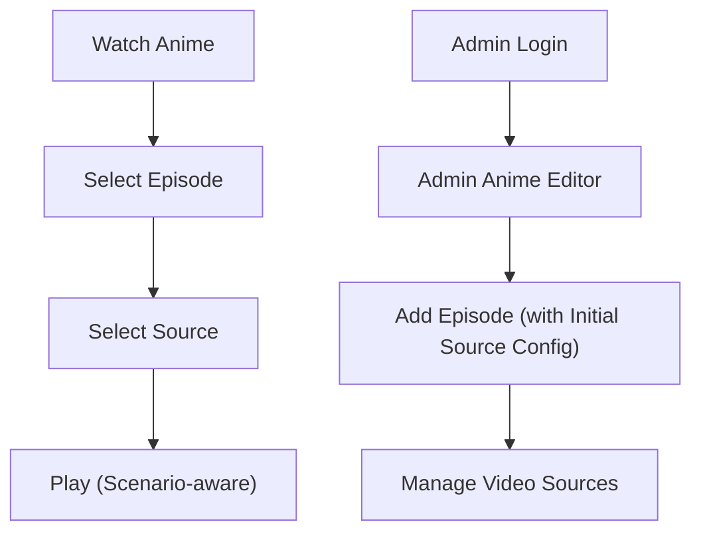

## 1. Product Overview
Refactor the Admin “Add Episode” flow to capture an initial video source configuration with 3 scenario rules, and update the public watch experience to respect those scenarios.
Goal: reduce admin errors, make episode creation + source creation consistent and predictable.

## 2. Core Features

### 2.1 User Roles
| Role | Registration Method | Core Permissions |
|------|---------------------|------------------|
| Viewer | No registration required | Can watch episodes and switch sources |
| Admin | Existing admin login | Can create/edit episodes and configure sources |

### 2.2 Feature Module
Our requirements consist of the following main pages:
1. **Watch Anime**: episode selection, source selection, scenario-aware player behavior.
2. **Admin Login**: authenticate to access admin pages.
3. **Admin Anime Editor**: add/edit episodes; configure initial source at creation; manage sources after creation.

### 2.3 Page Details
| Page Name | Module Name | Feature description |
|-----------|-------------|---------------------|
| Admin Anime Editor | Add Episode form | Create an episode with optional “Initial Source Config”. |
| Admin Anime Editor | Source scenario selector | Select 1 of 3 scenarios: Standard (Dub/Sub), Integrated (Dub+Sub in one player), External Player. |
| Admin Anime Editor | Scenario rule validation | Validate required fields per scenario (see rules below) and show inline errors before save. |
| Admin Anime Editor | Atomic create | Create episode + initial source in one action; avoid “episode created but source failed” partial state. |
| Admin Anime Editor | Post-create management | Continue supporting full Video Sources CRUD for the episode after creation. |
| Watch Anime | Scenario-aware UI | Hide language/voice-group selection when scenario requires it; keep episode navigation usable. |
| Watch Anime | Scenario-aware playback | Render iframe/direct players as today; for External Player show an “Open Player” CTA (new tab) as primary action for that source. |

**Source Config: 3 scenario rules**
1) **Standard (Dub/Sub-specific source)**
- Required: label, url, type (iframe/direct), audio (dub/sub)
- Forced: is_integrated_player = false
- Watch behavior: language/voice-group selection visible; source switching works normally.

2) **Integrated (Dub+Sub in one source)**
- Required: label, url, type (iframe/direct)
- Forced: is_integrated_player = true; audio ignored
- Watch behavior: language/voice-group selection hidden (single combined player).

3) **External Player (opens outside site)**
- Required: label (must be an “External” video label), url, type (iframe/direct)
- Forced: Watch UI treats it as combined (no dub/sub selection)
- Watch behavior: show “Open Player” button for the selected source (opens url in a new tab); show short disclaimer (“External player”).

## 3. Core Process
**Admin Flow**
1. Open Admin Anime Editor.
2. Enter episode number/duration and choose voice group.
3. (Optional) Configure Initial Source:
   - Choose scenario, fill required fields.
4. Save: system creates the episode and (if provided) creates the initial source.
5. (Optional) Add additional sources via Video Sources section.

**Viewer Flow**
1. Open an anime page and pick an episode.
2. Page selects the default active source.
3. If the selected source is Integrated or External, hide language/voice-group selection.
4. If the selected source is External, viewer uses “Open Player” CTA.

