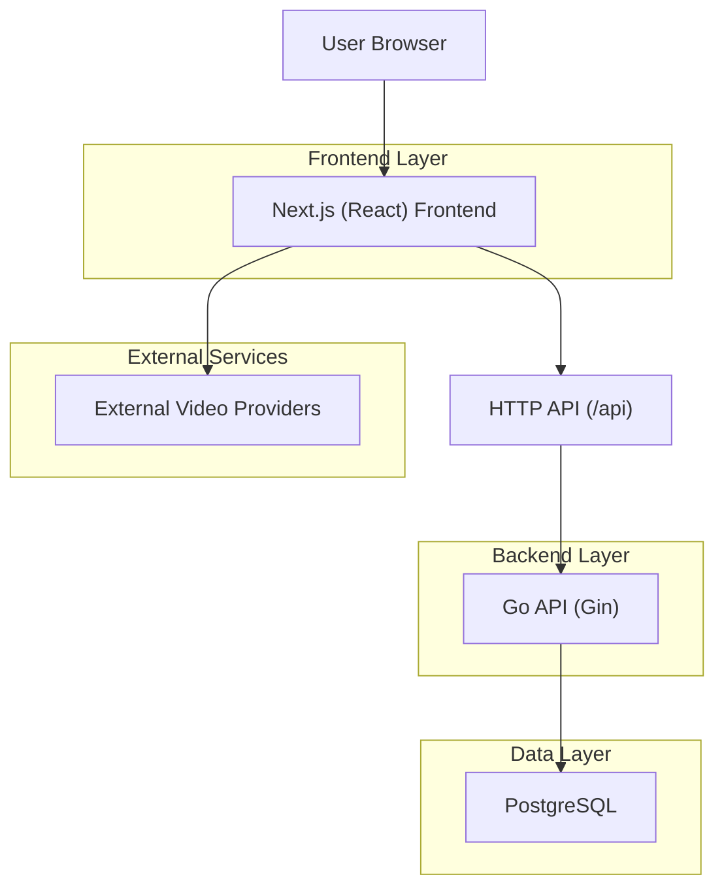
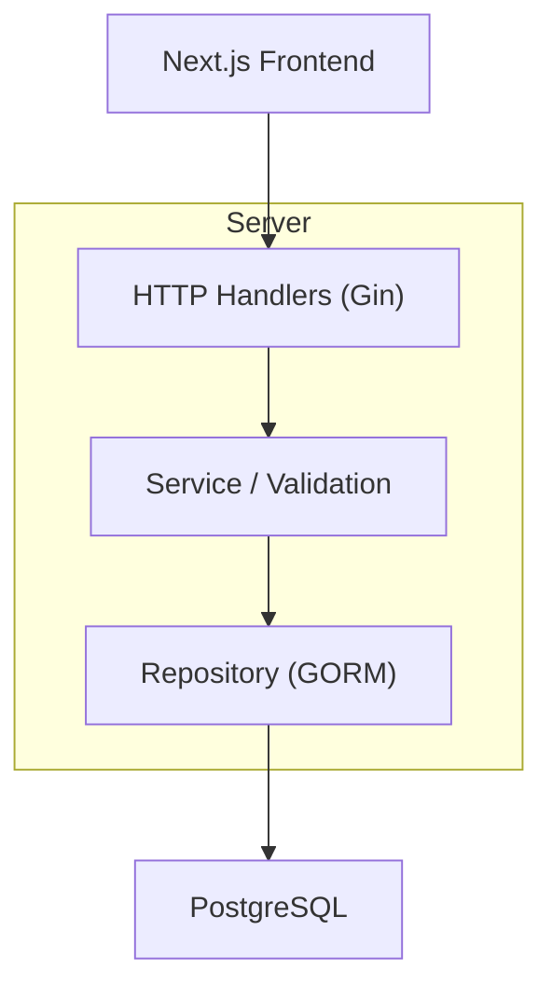
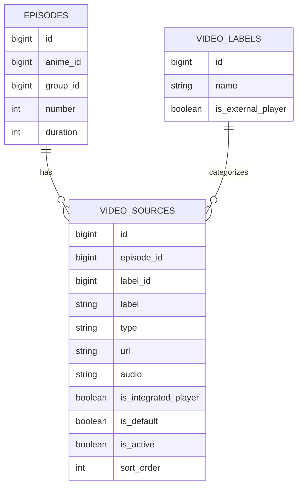

## 1.Architecture design


## 2.Technology Description
- Frontend: Next.js (React) + TypeScript + tailwindcss + shadcn/ui
- Backend: Go + gin + gorm
- Database: PostgreSQL

## 3.Route definitions
| Route | Purpose |
|-------|---------|
| /anime/[slug] | Public watch page (episode + source playback) |
| /admin/animes/[id] | Admin anime editor (episodes + sources management) |
| /login | Admin login entry (existing) |

## 4.API definitions
### 4.1 Core API
**Create episode with optional initial source (refactor)**

`POST /api/admin/animes/:animeId/episodes`

Request (new shape; backwards-compatible server should still accept the old shape initially):
```ts
type CreateEpisodeRequest = {
  episode: { group_id: number; number: number; duration?: number }
  initial_source?: {
    scenario: "standard" | "integrated" | "external"
    label_id?: number | null
    label?: string
    type: "iframe" | "direct"
    url: string
    audio?: "dub" | "sub" // required for scenario=standard
  }
}
```

Server-side scenario validation rules:
- standard: require audio; force is_integrated_player=false
- integrated: ignore audio; force is_integrated_player=true
- external: require label_id resolves to video_labels.is_external_player=true; force “hide language selection” semantics (handled by watch UI using video_label.is_external_player)

Response:
- Return created episode including `video_sources[]` (and `video_sources[].video_label`) so the admin UI can immediately reflect the created state.

**Public watch data requirement**
- Ensure public endpoints used by the watch page preload `VideoSources.VideoLabel` so the frontend can detect `is_external_player`.

## 5.Server architecture diagram


## 6.Data model(if applicable)
### 6.1 Data model definition


### 6.2 Data Definition Language
No new tables required.
- Reuse existing `video_sources.is_integrated_player` and `video_labels.is_external_player` to express the 3 scenarios.
- If you add the new `scenario` request wrapper, it is API-only (no DB migration).
