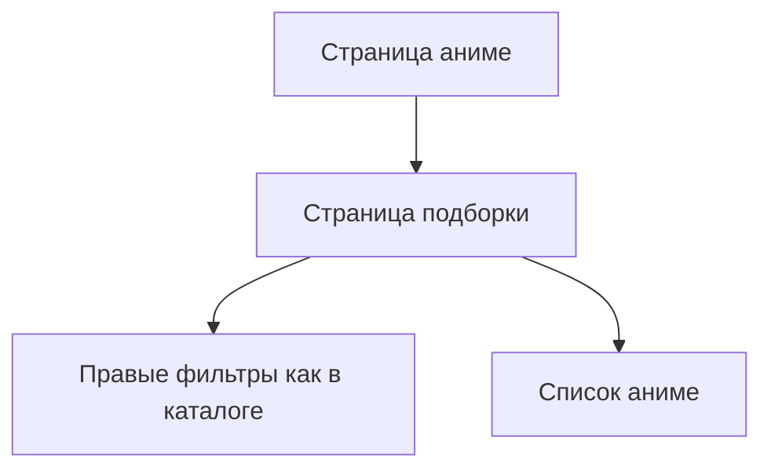

## 1. Product Overview
Кликабельные жанры/темы/рейтинг на странице аниме ведут на страницу «подборки» со списком аниме и фильтрами справа как в каталоге.
При переходе соответствующий фильтр уже выбран, а вверху страницы показаны RU/EN заголовок и описание (если есть).

## 2. Core Features

### 2.1 User Roles
Ролевое разделение не требуется: фича доступна всем посетителям.

### 2.2 Feature Module
Основные страницы для реализации фичи:
1. **Страница аниме**: кликабельные чипы жанров/тем/рейтинга, навигация в «подборку».
2. **Страница подборки**: шапка с RU/EN заголовком/описанием, список аниме, правые фильтры как в каталоге с предвыбранным значением.

### 2.3 Page Details
| Page Name | Module Name | Feature description |
|-----------|-------------|---------------------|
| Страница аниме | Кликабельные атрибуты | Открывать страницу подборки по клику на: • жанр • тему • рейтинг. Передавать выбранный фильтр так, чтобы он был предвыбран на странице подборки. |
| Страница подборки | Шапка подборки (RU/EN) | Показывать вверху RU и EN заголовок выбранного жанра/темы/рейтинга. Показывать описание на RU/EN, если оно есть; если описания нет — скрывать блок описания. |
| Страница подборки | Предвыбор фильтра | Инициализировать правые фильтры значением, полученным при переходе (жанр/тема/рейтинг). |
| Страница подборки | Правые фильтры (как в каталоге) | Отображать набор фильтров и поведение как в каталоге; разрешать пользователю менять/сбрасывать фильтры после предвыбора. |
| Страница подборки | Список аниме | Показывать список аниме, соответствующий текущим фильтрам (включая предвыбранный). |

## 3. Core Process
Поток пользователя:
1) Ты открываешь страницу аниме.
2) Нажимаешь на жанр, тему или рейтинг.
3) Открывается страница подборки: соответствующий фильтр уже выбран, сверху видно RU/EN заголовок и (если есть) описание.
4) Ты при желании уточняешь выбор правыми фильтрами как в каталоге и просматриваешь список аниме.

