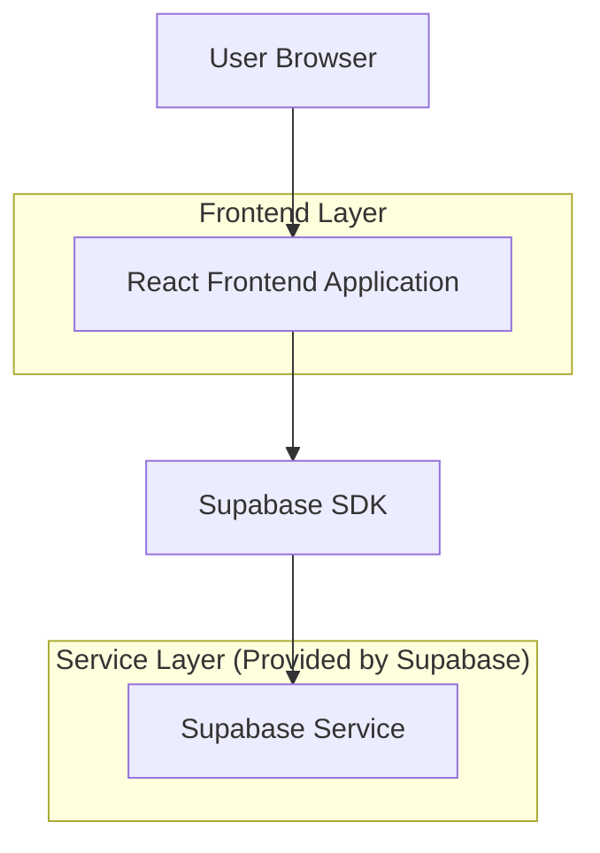
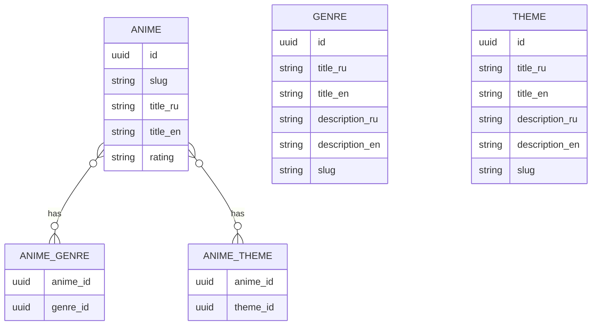

## 1.Architecture design


## 2.Technology Description
- Frontend: React@18 + (router) + (state management for filters) + tailwindcss@3
- Backend: Supabase (Auth + Postgres)

## 3.Route definitions
| Route | Purpose |
|-------|---------|
| /anime/:slug | Страница аниме; содержит кликабельные жанры/темы/рейтинг, ведущие в подборку |
| /collection | Страница подборки; показывает RU/EN заголовок/описание выбранного жанра/темы/рейтинга, список аниме и правые фильтры как в каталоге |

Рекомендуемый формат параметров для предвыбора фильтра (query params):
- /collection?kind=genre&id=<genreId>
- /collection?kind=theme&id=<themeId>
- /collection?kind=rating&value=<ratingValue>

Примечание: после инициализации состояния фильтров страница работает так же, как каталог (фильтры можно менять/сбрасывать).

## 6.Data model(if applicable)
### 6.1 Data model definition


### 6.2 Data Definition Language
GENRE (genres)
```
CREATE TABLE genres (
  id UUID PRIMARY KEY DEFAULT gen_random_uuid(),
  slug TEXT UNIQUE,
  title_ru TEXT NOT NULL,
  title_en TEXT NOT NULL,
  description_ru TEXT,
  description_en TEXT
);

GRANT SELECT ON genres TO anon;
GRANT ALL PRIVILEGES ON genres TO authenticated;
```

THEME (themes)
```
CREATE TABLE themes (
  id UUID PRIMARY KEY DEFAULT gen_random_uuid(),
  slug TEXT UNIQUE,
  title_ru TEXT NOT NULL,
  title_en TEXT NOT NULL,
  description_ru TEXT,
  description_en TEXT
);

GRANT SELECT ON themes TO anon;
GRANT ALL PRIVILEGES ON themes TO authenticated;
```

ANIME (animes)
```
-- предполагается, что таблица уже существует; для фичи важно наличие slug и rating
GRANT SELECT ON animes TO anon;
GRANT ALL PRIVILEGES ON animes TO authenticated;
```

Связи аниме ↔ жанры (anime_genres)
```
CREATE TABLE anime_genres (
  anime_id UUID NOT NULL,
  genre_id UUID NOT NULL
);

CREATE INDEX idx_anime_genres_anime_id ON anime_genres(anime_id);
CREATE INDEX idx_anime_genres_genre_id ON anime_genres(genre_id);

GRANT SELECT ON anime_genres TO anon;
GRANT ALL PRIVILEGES ON anime_genres TO authenticated;
```

Связи аниме ↔ темы (anime_themes)
```
CREATE TABLE anime_themes (
  anime_id UUID NOT NULL,
  theme_id UUID NOT NULL
);

CREATE INDEX idx_anime_themes_anime_id ON anime_themes(anime_id);
CREATE INDEX idx_anime_themes_theme_id ON anime_themes(theme_id);

GRANT SELECT ON anime_themes TO anon;
GRANT ALL PRIVILEGES ON anime_themes TO authenticated;
```
