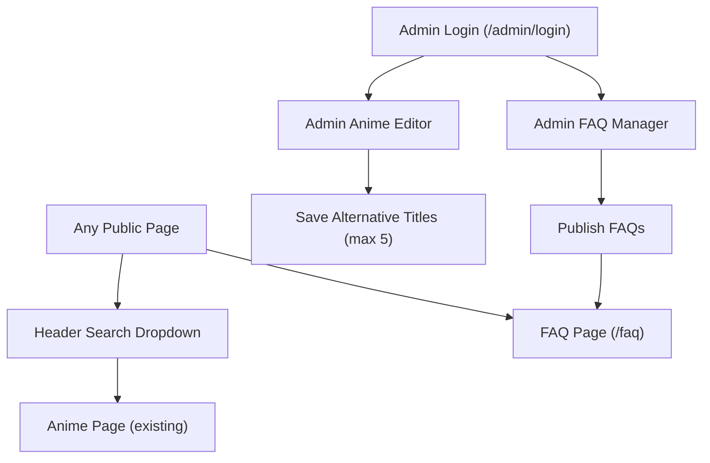

## 1. Product Overview
Add a bilingual (RU+EN) anime search in the site header, support up to 5 manual alternative titles per anime in the admin + database, and publish FAQs to a public /faq page rendered as an accordion.

## 2. Core Features

### 2.1 User Roles
| Role | Registration Method | Core Permissions |
|------|---------------------|------------------|
| Visitor | No registration | Can search anime (RU+EN) and read published FAQs on /faq |
| Admin | Supabase Auth login | Can edit up to 5 alternative titles per anime; can create/edit/publish FAQs |

### 2.2 Feature Module
1. **Public pages (Header + Search)**: header search input, RU+EN matching, suggestion dropdown, navigate to anime page.
2. **Public FAQ page**: published FAQ list in accordion.
3. **Admin login**: authenticate admins.
4. **Admin anime editor**: manage up to 5 manual alternative titles per anime.
5. **Admin FAQ manager**: CRUD FAQs and toggle publish.

### 2.3 Page Details
| Page Name | Module Name | Feature description |
|-----------|-------------|---------------------|
| Site header (global) | Anime search | Search by RU+EN query across primary titles and alternative titles; show top matches as dropdown; on select, navigate to anime page |
| FAQ page (/faq) | Published FAQ accordion | Fetch only published FAQs; render question list as accordion; allow expand/collapse; support deep-link to an item via URL hash (optional) |
| Admin login | Auth | Sign in via Supabase Auth; redirect to admin area after login |
| Admin anime editor | Alternative titles | View current alternative titles for an anime; add/edit/delete titles; enforce max 5 titles; validate non-empty and unique per anime |
| Admin FAQ manager | FAQ CRUD + publishing | Create/edit/delete FAQs; set display order; toggle published status; preview accordion rendering |

## 3. Core Process
Visitor Flow:
1. Type RU or EN text in the header search.
2. See up to N best matches in a dropdown.
3. Click a result to open the anime page.
4. Open /faq to browse published FAQs in an accordion.

Admin Flow:
1. Log in from /admin/login.
2. Open an anime in admin and manage up to 5 alternative titles.
3. Open FAQ manager, create/edit FAQs, set order, and publish.
4. Published FAQs appear on /faq.

