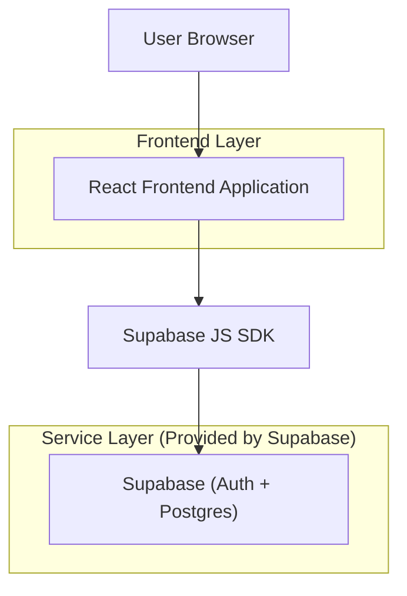
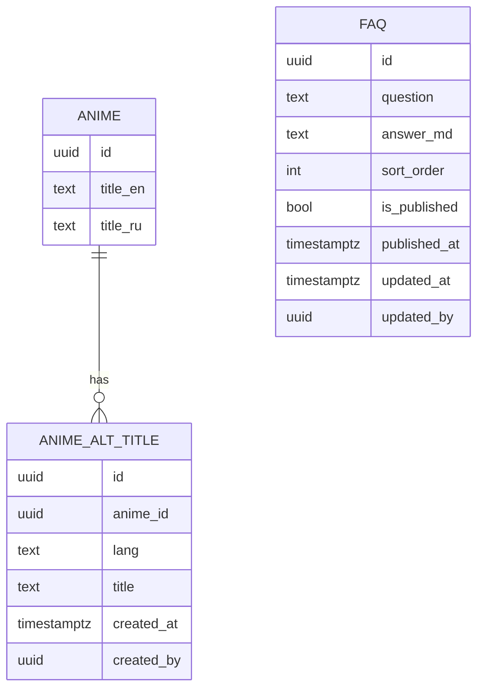

## 1.Architecture design


## 2.Technology Description
- Frontend: React@18 + TypeScript + tailwindcss@3 + vite
- Backend: Supabase (Auth + Postgres + RLS)

## 3.Route definitions
| Route | Purpose |
|-------|---------|
| / | Public pages with global header search |
| /faq | Public FAQ page showing published FAQs as accordion |
| /admin/login | Admin sign-in (Supabase Auth) |
| /admin/anime | Admin list/search anime (for editing) |
| /admin/anime/:id | Admin anime editor (alternative titles up to 5) |
| /admin/faq | Admin FAQ manager (CRUD + publish + order) |

## 6.Data model(if applicable)

### 6.1 Data model definition


### 6.2 Data Definition Language
Notes:
- The ANIME table is assumed to already exist; below adds new tables + search RPC.
- The “max 5 alt titles per anime” constraint is enforced by a trigger.

Anime alternative titles (anime_alt_titles)
```sql
CREATE TABLE IF NOT EXISTS anime_alt_titles (
  id UUID PRIMARY KEY DEFAULT gen_random_uuid(),
  anime_id UUID NOT NULL,
  lang TEXT NOT NULL CHECK (lang IN ('ru','en')),
  title TEXT NOT NULL,
  created_at TIMESTAMPTZ NOT NULL DEFAULT now(),
  created_by UUID
);

-- prevent duplicates per anime+lang+title
CREATE UNIQUE INDEX IF NOT EXISTS ux_anime_alt_titles_unique
  ON anime_alt_titles (anime_id, lang, lower(title));

-- enforce max 5 per anime
CREATE OR REPLACE FUNCTION enforce_alt_titles_max_5()
RETURNS trigger AS $$
BEGIN
  IF (SELECT count(*) FROM anime_alt_titles WHERE anime_id = NEW.anime_id) >= 5 THEN
    RAISE EXCEPTION 'Max 5 alternative titles per anime';
  END IF;
  RETURN NEW;
END;
$$ LANGUAGE plpgsql;

DROP TRIGGER IF EXISTS trg_enforce_alt_titles_max_5 ON anime_alt_titles;
CREATE TRIGGER trg_enforce_alt_titles_max_5
BEFORE INSERT ON anime_alt_titles
FOR EACH ROW EXECUTE FUNCTION enforce_alt_titles_max_5();
```

FAQs (faqs)
```sql
CREATE TABLE IF NOT EXISTS faqs (
  id UUID PRIMARY KEY DEFAULT gen_random_uuid(),
  question TEXT NOT NULL,
  answer_md TEXT NOT NULL,
  sort_order INT NOT NULL DEFAULT 0,
  is_published BOOLEAN NOT NULL DEFAULT false,
  published_at TIMESTAMPTZ,
  updated_at TIMESTAMPTZ NOT NULL DEFAULT now(),
  updated_by UUID
);

CREATE INDEX IF NOT EXISTS idx_faqs_published_sort
  ON faqs (is_published, sort_order, updated_at DESC);
```

Search RPC (search_anime)
```sql
-- Searches RU+EN across anime titles + alternative titles.
-- Returns only the fields needed for header suggestions.
CREATE OR REPLACE FUNCTION search_anime(q TEXT)
RETURNS TABLE (
  anime_id UUID,
  title_en TEXT,
  title_ru TEXT
) AS $$
  SELECT a.id AS anime_id, a.title_en, a.title_ru
  FROM anime a
  WHERE
    (a.title_en ILIKE '%' || q || '%') OR
    (a.title_ru ILIKE '%' || q || '%') OR
    EXISTS (
      SELECT 1
      FROM anime_alt_titles t
      WHERE t.anime_id = a.id AND t.title ILIKE '%' || q || '%'
    )
  ORDER BY a.title_en NULLS LAST
  LIMIT 10;
$$ LANGUAGE sql STABLE;
```

Access control (recommended)
```sql
-- grants (baseline)
GRANT SELECT ON anime_alt_titles TO anon;
GRANT ALL PRIVILEGES ON anime_alt_titles TO authenticated;
GRANT SELECT ON faqs TO anon;
GRANT ALL PRIVILEGES ON faqs TO authenticated;

-- enable RLS
ALTER TABLE anime_alt_titles ENABLE ROW LEVEL SECURITY;
ALTER TABLE faqs ENABLE ROW LEVEL SECURITY;

-- visitors can read alt titles for search
CREATE POLICY "alt_titles_read_public" ON anime_alt_titles
FOR SELECT TO anon, authenticated USING (true);

-- only authenticated can write alt titles
CREATE POLICY "alt_titles_write_auth" ON anime_alt_titles
FOR ALL TO authenticated USING (true) WITH CHECK (true);

-- visitors can read only published FAQs
CREATE POLICY "faqs_read_published" ON faqs
FOR SELECT TO anon, authenticated USING (is_published = true);

-- only authenticated can manage FAQs
CREATE POLICY "faqs_manage_auth" ON faqs
FOR ALL TO authenticated USING (true) WITH CHECK (true);
```