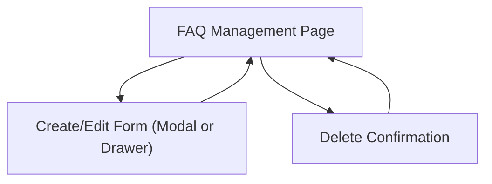

## 1. Product Overview
A small admin system to manage FAQ entries used by the site.
Admins can create, edit, list, and delete FAQs via an admin UI backed by Gin CRUD APIs.

## 2. Core Features

### 2.1 User Roles
| Role | Registration Method | Core Permissions |
|------|---------------------|------------------|
| Admin | Existing admin access (out of scope) | Full CRUD on FAQ entries via admin UI and `/api/admin/faq` APIs |

### 2.2 Feature Module
Our FAQ admin requirements consist of the following main pages:
1. **FAQ Management**: FAQ table list, create/edit form, delete action.

### 2.3 Page Details
| Page Name | Module Name | Feature description |
|-----------|-------------|---------------------|
| FAQ Management | FAQ list table | Display all FAQ entries with key fields (question, last updated). Provide per-row actions (edit, delete). Show loading and empty states. |
| FAQ Management | Create FAQ | Create a new FAQ entry by submitting a validated form (question, answer). Show success/error feedback and refresh the list. |
| FAQ Management | Edit FAQ | Load an existing FAQ entry into the form, update fields, submit changes, show success/error feedback and refresh the list. |
| FAQ Management | Delete FAQ | Delete an FAQ entry with a confirmation step; handle error feedback and refresh the list. |

## 3. Core Process
**Admin Flow**
1. Open the FAQ Management page.
2. Review existing FAQ entries in a table.
3. Create: click “Create”, fill in question/answer, submit, then see the new row in the table.
4. Edit: click “Edit” on a row, update question/answer, submit, then see the updated row in the table.
5. Delete: click “Delete” on a row, confirm deletion, then see the row removed from the table.

