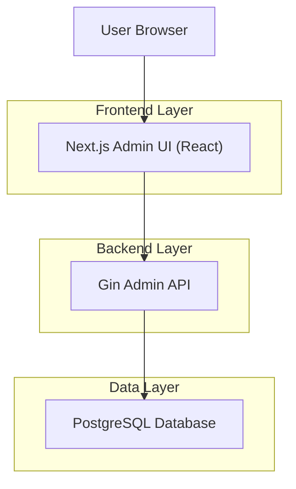
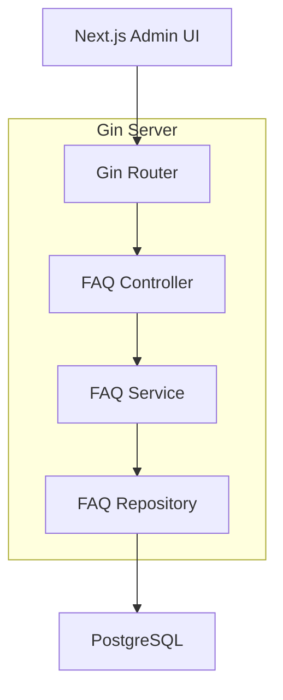
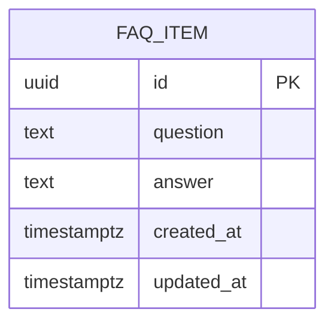

## 1.Architecture design


## 2.Technology Description
- Frontend: Next.js (React@18) + react-hook-form + zod + @hookform/resolvers
- Backend: Go + Gin
- Database: PostgreSQL

## 3.Route definitions
| Route | Purpose |
|-------|---------|
| /admin/faq | Admin page to view FAQ table and create/edit FAQs |

## 4.API definitions (If it includes backend services)
### 4.1 Core API
Base path: `/api/admin/faq` (protected by existing admin auth middleware; auth mechanism is out of scope).

#### List FAQs
`GET /api/admin/faq`

Response (200):
```ts
type FAQ = {
  id: string
  question: string
  answer: string
  createdAt: string // ISO
  updatedAt: string // ISO
}

type ListFAQResponse = { items: FAQ[] }
```

#### Get FAQ by id
`GET /api/admin/faq/:id`

Response (200):
```ts
type GetFAQResponse = { item: FAQ }
```

#### Create FAQ
`POST /api/admin/faq`

Request:
```ts
type CreateFAQRequest = {
  question: string
  answer: string
}
```

Response (201):
```ts
type CreateFAQResponse = { item: FAQ }
```

#### Update FAQ
`PUT /api/admin/faq/:id`

Request:
```ts
type UpdateFAQRequest = {
  question: string
  answer: string
}
```

Response (200):
```ts
type UpdateFAQResponse = { item: FAQ }
```

#### Delete FAQ
`DELETE /api/admin/faq/:id`

Response (204): no body

#### Error shape (common)
```ts
type ApiError = { message: string }
```

## 5.Server architecture diagram (If it includes backend services)


## 6.Data model(if applicable)

### 6.1 Data model definition


### 6.2 Data Definition Language
FAQ Table (`faq_items`)
```sql
-- create table
CREATE TABLE faq_items (
  id UUID PRIMARY KEY DEFAULT gen_random_uuid(),
  question TEXT NOT NULL,
  answer TEXT NOT NULL,
  created_at TIMESTAMPTZ NOT NULL DEFAULT NOW(),
  updated_at TIMESTAMPTZ NOT NULL DEFAULT NOW()
);

-- (optional) simple index for admin ordering by update time
CREATE INDEX idx_faq_items_updated_at ON faq_items(updated_at DESC);
```
