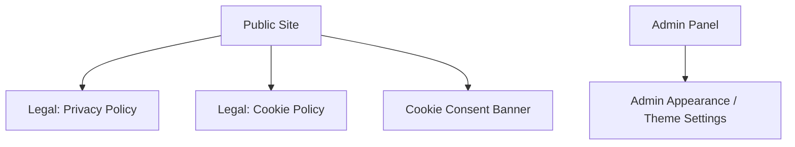

## 1. Product Overview
Roll out a complete, consistent **Light Theme** across the public site and admin panel using semantic design tokens.
Add an **admin-only theme toggle** (for admin UI preview/comfort), remove hardcoded dark styling, and improve **cookie consent + legal page readability**.

## 2. Core Features

### 2.1 User Roles
| Role | Registration Method | Core Permissions |
|------|---------------------|------------------|
| Public Visitor | No registration | Browse public site; view legal pages; interact with cookie consent banner |
| Admin | Existing admin access | Access admin panel; use admin-only theme toggle; manage appearance settings (if enabled) |

### 2.2 Feature Module
1. **Public Site (all pages)**: light palette applied via tokens; no public theme toggle; consistent typography/contrast.
2. **Cookie Consent + Legal Pages**: improved content readability (spacing, line length, headings, contrast) in light theme.
3. **Admin Panel (all pages)**: light palette applied via tokens; removal of hardcoded/dark-only classes.
4. **Admin Appearance / Theme Settings**: admin-only theme toggle (Light/Dark/System or Light/Dark) affecting admin UI only.

### 2.3 Page Details
| Page Name | Module Name | Feature description |
|-----------|-------------|---------------------|
| Public Site (Global UI Shell) | Theme tokens | Apply semantic color tokens (background/surface/text/border/brand/status) to all shared components; eliminate hardcoded colors.
| Public Site (Global UI Shell) | Component consistency | Ensure buttons, links, cards, inputs, alerts, badges, tables use token-based variants with accessible contrast.
| Cookie Consent + Legal Pages | Readability | Increase base font size/line-height; constrain max content width; strengthen heading hierarchy; ensure link and muted text contrast in light mode.
| Admin Panel (Global UI Shell) | Theme tokens | Apply same semantic tokens to admin layout + components; remove hardcoded dark classes (e.g., fixed black backgrounds) in favor of tokens.
| Admin Appearance / Theme Settings | Admin-only toggle | Allow admin to switch admin UI theme; persist preference; never expose toggle on public pages.

## 3. Core Process
**Public flow**: You visit the site and always see the Light Theme; cookie banner and legal pages remain easy to read with strong contrast and comfortable typography.

**Admin flow**: You open the admin panel and see Light Theme by default; you can toggle the admin UI theme (e.g., Light/Dark/System) and your preference persists for subsequent admin sessions.

