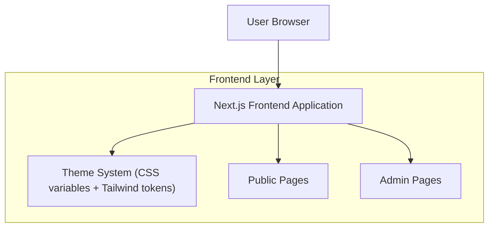

## 1.Architecture design

## 2.Technology Description
- Frontend: Next.js@16 + React@19 + TypeScript@5
- Styling: TailwindCSS@4 + CSS variables (design tokens)
- Theme switching (admin-only): next-themes (already in dependencies)
- Backend: None required for palette rollout (reuse existing admin auth/guards)

## 3.Route definitions
| Route | Purpose |
|-------|---------|
| / | Public site entry; always uses Light Theme |
| /legal/privacy | Privacy policy page; improved readability in Light Theme |
| /legal/cookies | Cookie policy page; improved readability in Light Theme |
| /admin | Admin entry; Light Theme by default |
| /admin/appearance | Admin-only theme toggle; persists admin UI preference |

## 4.API definitions (If it includes backend services)
N/A

## 6.Data model(if applicable)
N/A

### Implementation notes (non-exhaustive)
- Use **semantic token classes** (e.g., bg-background, text-foreground, border-border) instead of hardcoded values and instead of scattered dark-mode overrides.
- Define theme palettes via CSS variables:
  - Light: set on `:root` (public + admin default)
  - Dark (admin-only): set on `[data-theme='dark']` or `.dark` applied only within admin scope
- Preference persistence for admin theme:
  - Store using next-themes default storage (localStorage) OR existing admin preference mechanism.
  - Ensure public pages do not render the toggle UI.
