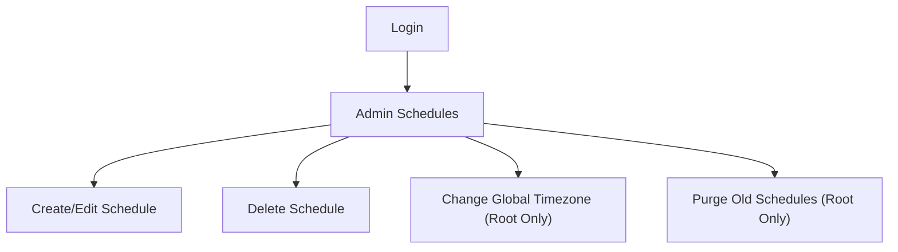

## 1. Product Overview
LycorisLib scheduling admin adds safe timezone management and faster schedule operations.
Root users can change the global timezone, regroup schedules by weekday, and purge old schedules in one click.

## 2. Core Features

### 2.1 User Roles
| Role | Registration Method | Core Permissions |
|------|---------------------|------------------|
| Admin | Supabase Auth login | View schedules; group/browse by weekday; manage individual schedules. |
| Root Admin | Supabase Auth login (email allowlist / role claim) | All Admin permissions plus change global timezone (with recalculation) and run one-click purge of schedules older than 1 month. |

### 2.2 Feature Module
Our LycorisLib scheduling requirements consist of the following main pages:
1. **Login**: authenticate admin users.
2. **Admin Schedules**: weekday-grouped schedule view; root-only timezone setting with recalculation; root-only one-click purge of schedules older than 1 month.

### 2.3 Page Details
| Page Name | Module Name | Feature description |
|-----------|-------------|---------------------|
| Login | Authentication form | Sign in with Supabase Auth; show validation + error state; redirect to Admin Schedules on success. |
| Admin Schedules | Access control | Gate page by auth; hide/disable root-only controls unless user is Root Admin. |
| Admin Schedules | Weekday-grouped schedule list | Group schedules into Monday–Sunday sections; allow expand/collapse per weekday; show key fields (name, weekday, time, status, next run). |
| Admin Schedules | Schedule actions | Create/edit/delete a schedule; validate weekday + time; persist changes. |
| Admin Schedules | Global timezone (root-only) | Select a single global timezone; on save, recalculate all schedules to match the new timezone rules; show preview summary (how many schedules affected) and require confirmation. |
| Admin Schedules | No cumulative time shifting guarantee | Ensure repeated timezone changes never “double-shift” schedule times; use an immutable schedule definition as the source of truth, and only recompute derived run times from it. |
| Admin Schedules | One-click purge old schedules (root-only) | Delete schedules older than 1 month in one action; show count to be deleted, require confirmation, then display success/failure + deleted count. |

## 3. Core Process
**Admin Flow**
1. You sign in.
2. You open Admin Schedules to view all schedules grouped by weekday.
3. You create, edit, or delete individual schedules.

**Root Admin Flow**
1. You sign in.
2. You open Admin Schedules.
3. You change the global timezone.
   - You review a confirmation that schedules will be recalculated.
   - LycorisLib recomputes derived schedule run times from the immutable schedule definition to avoid cumulative shifting.
4. You optionally click “Purge schedules older than 1 month”, confirm, and LycorisLib deletes them.

