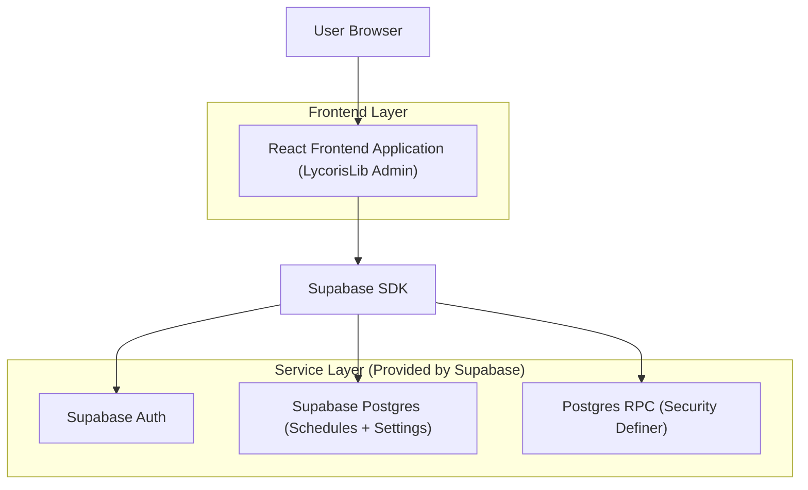
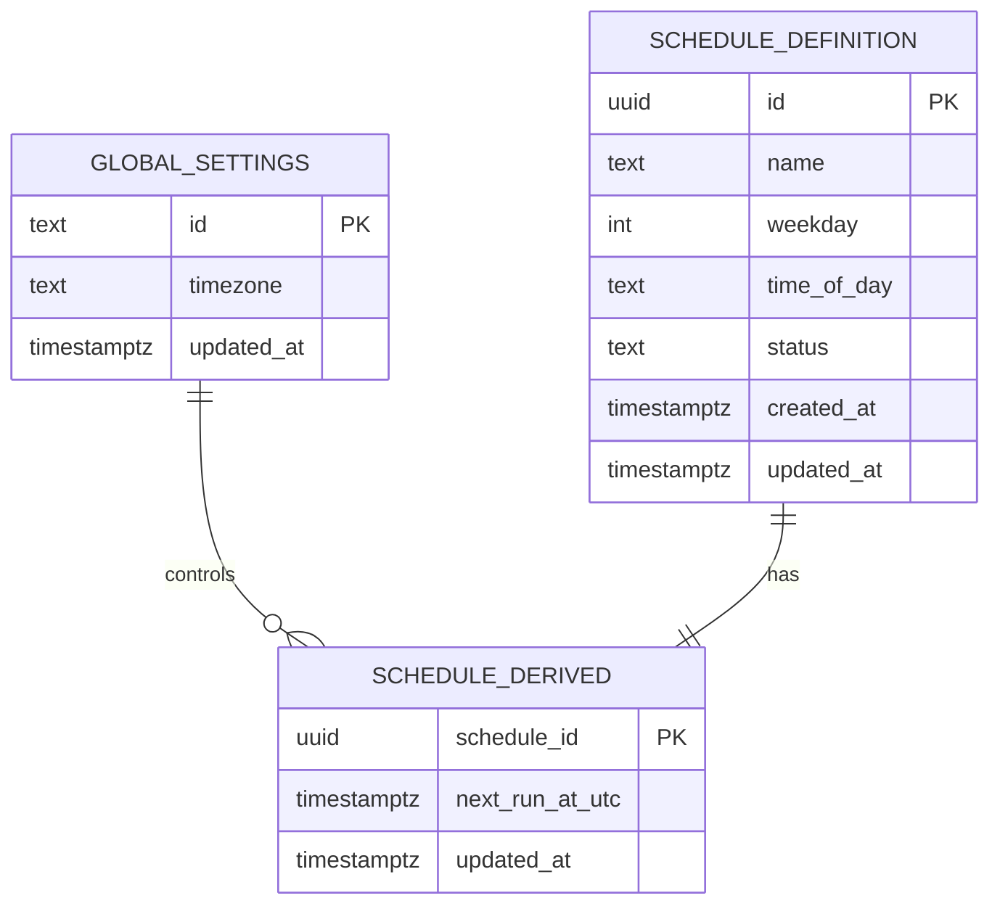

## 1.Architecture design


## 2.Technology Description
- Frontend: React@18 + TypeScript + tailwindcss@3 + vite
- Backend: Supabase (Auth + Postgres + RPC)

## 3.Route definitions
| Route | Purpose |
|-------|---------|
| /login | Admin authentication via Supabase Auth |
| /admin/schedules | Weekday-grouped schedule management; root-only timezone + purge actions |

## 4.API definitions (If it includes backend services)
### 4.1 Shared TypeScript types
```ts
export type Weekday = 0 | 1 | 2 | 3 | 4 | 5 | 6; // 0=Mon ... 6=Sun

export type ScheduleStatus = "active" | "paused" | "completed" | "cancelled";

// Immutable, non-shifting definition (source of truth)
export type ScheduleDefinition = {
  id: string;
  name: string;
  weekday: Weekday;
  timeOfDay: string; // "HH:mm" (24h)
  status: ScheduleStatus;
  createdAt: string; // ISO
};

// Derived execution time (recomputed on timezone changes)
export type ScheduleDerived = {
  scheduleId: string;
  nextRunAtUtc: string; // ISO UTC
  updatedAt: string; // ISO
};

export type GlobalSettings = {
  timezone: string; // IANA TZ, e.g. "America/New_York"
  updatedAt: string; // ISO
};
```

### 4.2 Supabase RPC definitions
#### Update global timezone and recalculate schedules (root-only)
- RPC name: `rpc_update_timezone_and_recalculate`

Request:
| Param Name | Param Type | isRequired | Description |
|-----------|------------|------------|-------------|
| new_timezone | string | true | New global IANA timezone |
| dry_run | boolean | false | If true, returns impact summary without applying |

Response:
| Param Name | Param Type | Description |
|-----------|------------|-------------|
| affected_count | number | How many schedules were recalculated |
| old_timezone | string | Previous timezone |
| new_timezone | string | New timezone |

#### Purge schedules older than 1 month (root-only)
- RPC name: `rpc_purge_old_schedules`

Request:
| Param Name | Param Type | isRequired | Description |
|-----------|------------|------------|-------------|
| older_than_days | number | false | Defaults to 30 |

Response:
| Param Name | Param Type | Description |
|-----------|------------|-------------|
| deleted_count | number | How many schedules were deleted |

## 6.Data model(if applicable)

### 6.1 Data model definition


### 6.2 Data Definition Language
Global Settings (global_settings)
```
CREATE TABLE global_settings (
  id TEXT PRIMARY KEY DEFAULT 'singleton',
  timezone TEXT NOT NULL,
  updated_at TIMESTAMPTZ NOT NULL DEFAULT NOW()
);

-- singleton row
INSERT INTO global_settings (id, timezone)
VALUES ('singleton', 'UTC')
ON CONFLICT (id) DO NOTHING;
```

Schedules (schedule_definition)
```
CREATE TABLE schedule_definition (
  id UUID PRIMARY KEY DEFAULT gen_random_uuid(),
  name TEXT NOT NULL,
  weekday INT NOT NULL, -- 0=Mon ... 6=Sun
  time_of_day TEXT NOT NULL, -- "HH:mm"
  status TEXT NOT NULL DEFAULT 'active',
  created_at TIMESTAMPTZ NOT NULL DEFAULT NOW(),
  updated_at TIMESTAMPTZ NOT NULL DEFAULT NOW()
);

CREATE INDEX idx_schedule_definition_weekday ON schedule_definition(weekday);
CREATE INDEX idx_schedule_definition_created_at ON schedule_definition(created_at DESC);
```

Derived schedule execution (schedule_derived)
```
CREATE TABLE schedule_derived (
  schedule_id UUID PRIMARY KEY,
  next_run_at_utc TIMESTAMPTZ NOT NULL,
  updated_at TIMESTAMPTZ NOT NULL DEFAULT NOW()
);

CREATE INDEX idx_schedule_derived_next_run_at_utc ON schedule_derived(next_run_at_utc);
```

RLS + Grants (typical Supabase pattern)
```
-- grants
GRANT SELECT ON global_settings TO anon;
GRANT SELECT ON schedule_definition TO anon;
GRANT SELECT ON schedule_derived TO anon;

GRANT ALL PRIVILEGES ON global_settings TO authenticated;
GRANT ALL PRIVILEGES ON schedule_definition TO authenticated;
GRANT ALL PRIVILEGES ON schedule_derived TO authenticated;
```

## No cumulative time shifting (implementation rule)
- LycorisLib treats `schedule_definition (weekday + time_of_day)` as immutable source of truth.
- `schedule_derived.next_run_at_utc` is always recomputed from:
  1) the current global timezone (`global_settings.timezone`) and
  2) the immutable schedule definition.
- The timezone change RPC MUST NOT shift based on previous `next_run_at_utc` values; it overwrites them from a fresh recomputation.
- This prevents cumulative drift when the timezone is changed multiple times.
