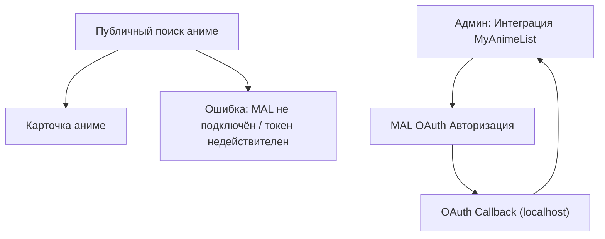

## 1. Product Overview
Добавить вход через MyAnimeList по OAuth 2.0 PKCE на localhost, хранение access/refresh токенов и поиск аниме через MAL API v2.
Цель: дать админке возможность подключить MAL-аккаунт и использовать MAL API для поиска/просмотра данных об аниме.

## 2. Core Features

### 2.1 User Roles
| Role | Registration Method | Core Permissions |
|------|---------------------|------------------|
| Публичный пользователь | Не требуется | Может искать аниме и открывать карточку аниме (через подключение MAL, настроенное админом) |
| Администратор | Существующая авторизация админки проекта | Может запустить OAuth PKCE-подключение MAL, видеть/обновлять/отзывать токены, проверять статус интеграции |

### 2.2 Feature Module
Наши требования состоят из следующих страниц:
1. **Публичный поиск аниме**: строка поиска, результаты, фильтры (минимальные), переход к карточке.
2. **Карточка аниме**: основная информация, картинки (если доступны), ссылка на MAL.
3. **Админ: Интеграция MyAnimeList**: подключение через OAuth PKCE, статус токена, действия “обновить/отозвать”.

### 2.3 Page Details
| Page Name | Module Name | Feature description |
|-----------|-------------|---------------------|
| Публичный поиск аниме | Поисковая форма | Принимать запрос (строка), валидировать, запускать поиск через MAL API v2 |
| Публичный поиск аниме | Список результатов | Показывать список найденных тайтлов (название, постер, год/тип при наличии); открывать карточку |
| Публичный поиск аниме | Состояния | Показывать состояния: загрузка, пусто, ошибка (например, “не подключён MAL”) |
| Карточка аниме | Детали | Загружать и отображать детали по MAL anime_id; показывать внешний линк на MAL |
| Карточка аниме | Навигация | Возврат к результатам/назад |
| Админ: Интеграция MyAnimeList | Подключение OAuth PKCE | Запускать OAuth (генерация verifier/challenge/state), переадресация на MAL, обработка callback |
| Админ: Интеграция MyAnimeList | Управление токенами | Отображать “подключено/не подключено”, срок жизни access token; выполнять refresh; выполнять revoke/сброс |
| Админ: Интеграция MyAnimeList | Диагностика | Выполнять тестовый запрос к MAL API и показывать код/сообщение ошибки |

## 3. Core Process
**Админский поток (подключение MAL):**
1) Админ открывает “Админ: Интеграция MyAnimeList” и нажимает “Подключить MAL”.
2) Система начинает PKCE: генерирует code_verifier, code_challenge и state; перенаправляет админа на страницу авторизации MAL.
3) MAL перенаправляет обратно на localhost callback с code и state.
4) Система обменивает code на access_token/refresh_token, сохраняет токены и срок действия.
5) Админ видит статус “Подключено”, может сделать refresh или revoke.

**Публичный поток (поиск):**
1) Пользователь открывает публичный поиск, вводит запрос.
2) Система выполняет поиск через MAL API v2, используя сохранённый токен.
3) Пользователь открывает карточку аниме.

