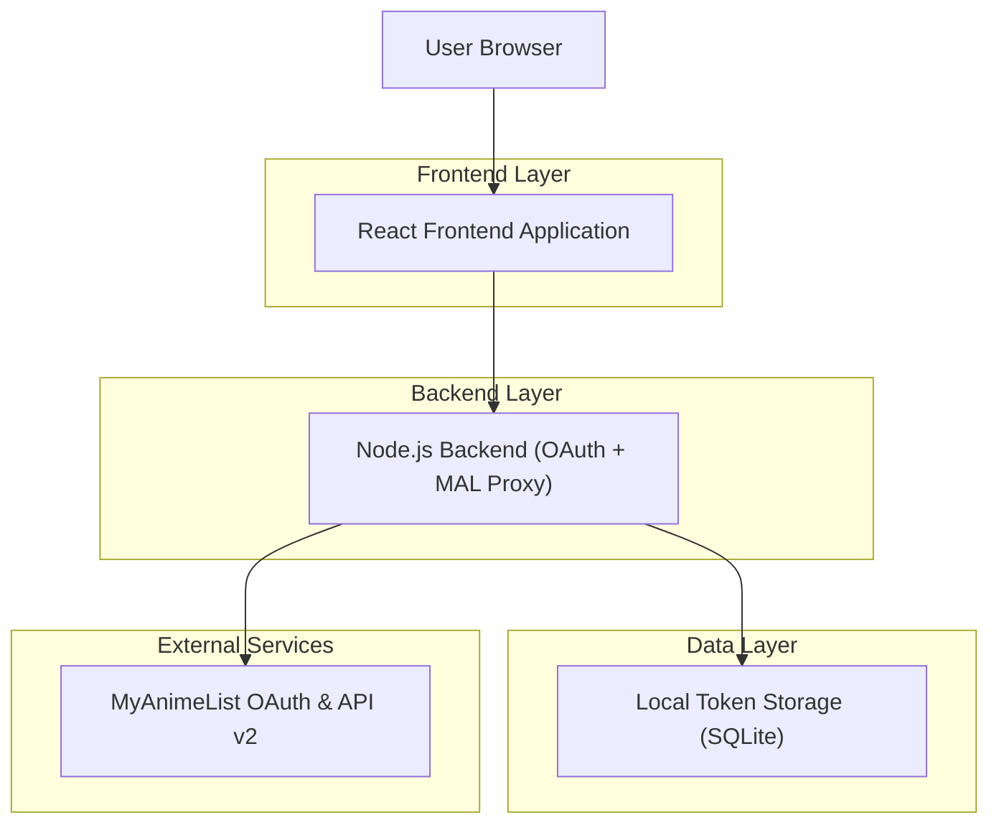
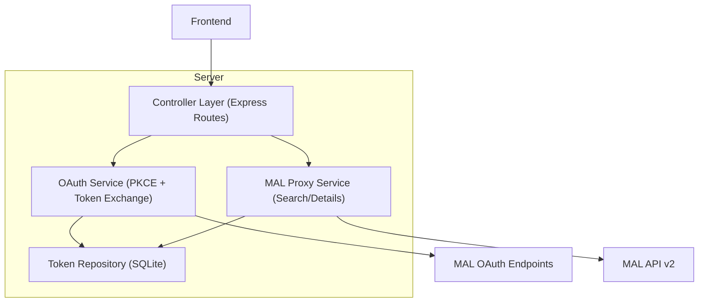
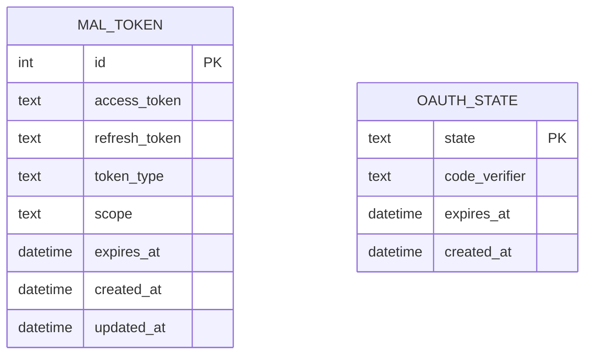

## 1.Architecture design


## 2.Technology Description
- Frontend: React@18 + TypeScript + vite
- Backend: Node.js@20 + Express@4 (или совместимый минимальный HTTP framework)
- Database (локально): SQLite (файл) для хранения refresh/access токенов

## 3.Route definitions
| Route | Purpose |
|-------|---------|
| / | Публичная страница поиска аниме |
| /anime/:id | Публичная карточка аниме |
| /admin/mal | Админ: экран интеграции MAL (подключение, статус, действия) |
| /admin/mal/callback | Админ: SPA/страница-обработчик callback после OAuth редиректа |

**Публичные маршруты:** `/`, `/anime/:id`

**Админские маршруты:** `/admin/mal`, `/admin/mal/callback`

## 4.API definitions (If it includes backend services)
### 4.1 Core API

#### Запуск OAuth PKCE
```
GET /api/admin/mal/oauth/start
```
Назначение: генерирует PKCE (verifier/challenge) + state, сохраняет state/verifier на время сессии, возвращает URL авторизации MAL (или делает redirect).

Response (вариант JSON):
| Param Name| Param Type  | Description |
|-----------|-------------|-------------|
| authorizeUrl | string | URL для перехода на страницу MAL authorize |

#### OAuth callback (обмен code на токены)
```
GET /api/admin/mal/oauth/callback?code=...&state=...
```
Назначение: проверяет state, обменивает code на tokens на token endpoint, сохраняет access_token/refresh_token/expires_at.

Response:
| Param Name| Param Type  | Description |
|-----------|-------------|-------------|
| connected | boolean | Успешно ли подключение |

#### Статус токенов
```
GET /api/admin/mal/tokens
```
Назначение: вернуть “подключено/не подключено”, expires_at, ошибки последнего refresh.

#### Принудительный refresh
```
POST /api/admin/mal/tokens/refresh
```
Назначение: обновить access_token по refresh_token и сохранить результат.

#### Отозвать/сбросить токены
```
POST /api/admin/mal/tokens/revoke
```
Назначение: отозвать токены (если доступно) и очистить локальное хранилище.

#### Поиск аниме (публично)
```
GET /api/public/mal/anime/search?q=...&limit=...
```
Назначение: проксировать MAL API v2 search (используя актуальный access_token; при истечении — auto-refresh).

Response (тип):
```ts
export type MalAnimeSearchItem = {
  id: number;
  title: string;
  main_picture?: { medium?: string; large?: string };
};

export type MalAnimeSearchResponse = {
  data: Array<{ node: MalAnimeSearchItem }>;
};
```

#### Детали аниме (публично)
```
GET /api/public/mal/anime/:id
```
Назначение: получить детали тайтла по `id`.

### 4.2 Security / Access rules
- Все `/api/admin/*` доступны только после существующей админ-авторизации проекта (middleware/guard на сервере).
- Токены MAL никогда не отдаются в браузер напрямую; фронтенд работает только через backend proxy.
- PKCE verifier/state хранить только на сервере (например, в server session / signed cookie / in-memory store) до завершения callback.

## 5.Server architecture diagram (If it includes backend services)


## 6.Data model(if applicable)
### 6.1 Data model definition


### 6.2 Data Definition Language
SQLite schema:
```
CREATE TABLE IF NOT EXISTS mal_token (
  id INTEGER PRIMARY KEY AUTOINCREMENT,
  access_token TEXT NOT NULL,
  refresh_token TEXT NOT NULL,
  token_type TEXT,
  scope TEXT,
  expires_at TEXT NOT NULL,
  created_at TEXT DEFAULT (datetime('now')),
  updated_at TEXT DEFAULT (datetime('now'))
);

CREATE TABLE IF NOT EXISTS oauth_state (
  state TEXT PRIMARY KEY,
  code_verifier TEXT NOT NULL,
  expires_at TEXT NOT NULL,
  created_at TEXT DEFAULT (datetime('now'))
);

CREATE INDEX IF NOT EXISTS idx_oauth_state_expires_at ON oauth_state(expires_at);
```

Notes:
- Секреты/настройки держать в env: `MAL_CLIENT_ID`, `MAL_REDIRECT_URI` (localhost), опционально `MAL_CLIENT_SECRET` (если MAL тип приложения это требует) — только на сервере.
- Backend должен автоматически делать refresh при `401/invalid_token` или по `expires_at` до запр