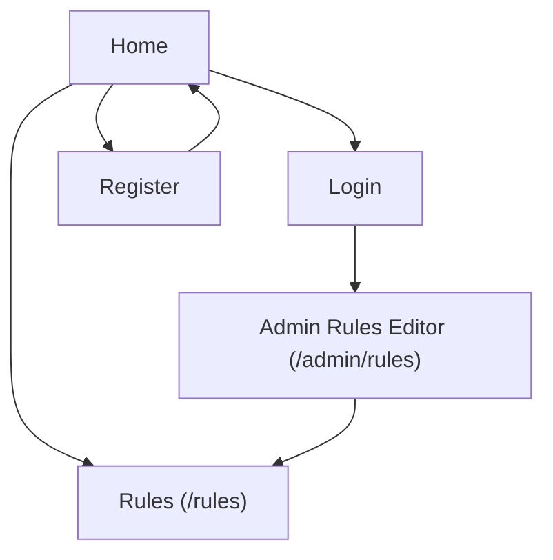

## 1. Product Overview
Add an admin-managed Rules content store in English and Russian, and expose it publicly via a /rules page.
Ensure RU content falls back to EN when missing, add a header navigation link, and enforce consistent username constraints on both frontend and backend.

## 2. Core Features

### 2.1 User Roles
| Role | Registration Method | Core Permissions |
|------|---------------------|------------------|
| Public Visitor | None | Can open /rules and read Rules content (RU with fallback to EN) |
| Registered User | Existing registration flow | Username must comply with constraints; can use the site as usual |
| Admin | Existing admin sign-in | Can create/update Rules content for EN/RU |

### 2.2 Feature Module
Our requirements consist of the following main pages:
1. **Public Rules page**: language resolution (RU fallback to EN), render Rules content.
2. **Admin Rules editor page**: edit EN/RU Rules content, save to storage.
3. **Authentication pages (existing)**: enforce username constraints during register/update.

### 2.3 Page Details
| Page Name | Module Name | Feature description |
|-----------|-------------|------------------|
| Global Header (site-wide) | Navigation link | Add a “Rules” link that navigates to /rules and indicates active state when on /rules. |
| Public Rules page (/rules) | Content resolution | Resolve display language as RU when requested/selected; fall back to EN if RU content is missing/empty; default to EN when neither RU is requested nor available. |
| Public Rules page (/rules) | Rules rendering | Render the stored Rules content with basic typography; show “Last updated” timestamp if available. |
| Public Rules page (/rules) | Error/empty states | Show a friendly message when no EN Rules exist (hard empty state) and avoid exposing admin-only details. |
| Admin Rules editor (/admin/rules) | Access control | Restrict access to Admin users only; redirect non-admin authenticated users away; prompt unauthenticated users to sign in. |
| Admin Rules editor (/admin/rules) | Language editing | Provide a clear way to edit EN and RU content separately (e.g., tabs/segmented control). |
| Admin Rules editor (/admin/rules) | Persistence | Save changes to storage; show save success/failure; prevent accidental loss (dirty-state warning). |
| Registration / Profile (existing) | Username validation (frontend) | Validate on input and on submit: length 4–30; ASCII-only; allowed symbols: letters (A–Z, a–z), digits (0–9), underscore (_), dot (.), hyphen (-). |
| Registration / Profile (existing) | Username validation (backend) | Enforce the same rules server-side so invalid usernames cannot be created/updated via direct API calls. |
| Registration / Profile (existing) | Error messaging | Display clear, actionable validation errors (e.g., “Use 4–30 characters: A–Z, 0–9, underscore, dot, hyphen”). |

## 3. Core Process
**Public visitor flow**
1. You click “Rules” in the header.
2. The /rules page loads the Rules content.
3. If RU is requested/selected and RU content exists, it is shown; otherwise EN is shown.

**Admin flow**
1. You sign in as Admin.
2. You open /admin/rules.
3. You edit EN and/or RU content and click Save.
4. Changes become visible on /rules immediately after save.

**Registration / username flow (existing screens)**
1. You type a username.
2. The UI validates format and shows errors instantly.
3. On submit, the backend re-validates and either accepts or rejects the username.

