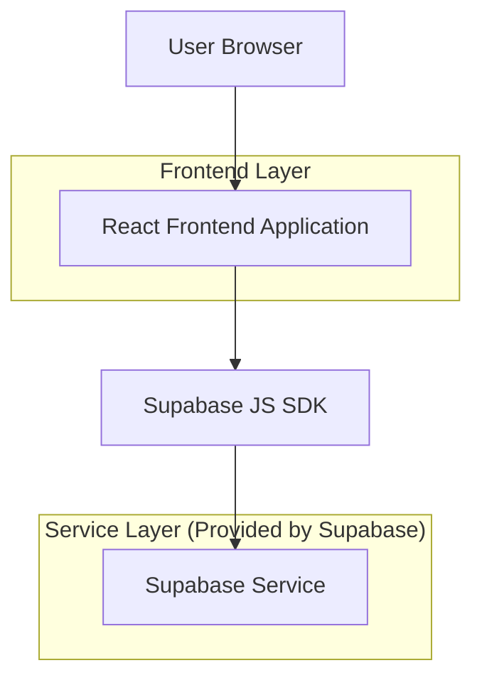
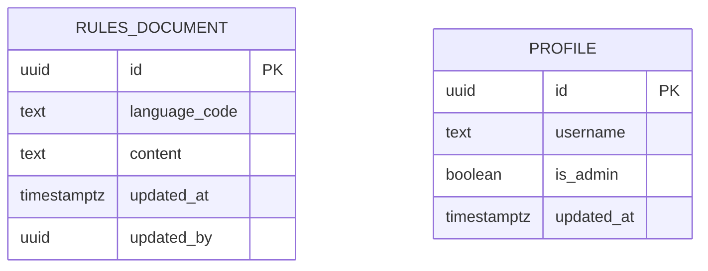

## 1.Architecture design


## 2.Technology Description
- Frontend: React@18 + (existing router) + (existing UI styling)
- Backend: Supabase (Auth + PostgreSQL)

## 3.Route definitions
| Route | Purpose |
|-------|---------|
| /rules | Public Rules page (RU display with fallback to EN) |
| /admin/rules | Admin-only Rules editor (edit EN/RU and save) |
| /login | Admin sign-in entry (existing) |
| /register (or existing signup route) | User registration where username constraints are enforced |
| /profile (if username editable) | Username update with the same constraints |

## 4.API definitions (If it includes backend services)
Backend is provided by Supabase; no custom server API is required for this scope.

## 6.Data model(if applicable)

### 6.1 Data model definition


### 6.2 Data Definition Language
Rules documents table (rules_documents)
```
-- create table
CREATE TABLE rules_documents (
  id UUID PRIMARY KEY DEFAULT gen_random_uuid(),
  language_code TEXT NOT NULL CHECK (language_code IN ('en','ru')),
  content TEXT NOT NULL DEFAULT '',
  updated_at TIMESTAMPTZ NOT NULL DEFAULT NOW(),
  updated_by UUID NULL,
  UNIQUE (language_code)
);

-- recommended indexes
CREATE INDEX idx_rules_documents_updated_at ON rules_documents(updated_at DESC);

-- seed (optional): ensure EN row exists
INSERT INTO rules_documents (language_code, content)
VALUES ('en', '')
ON CONFLICT (language_code) DO NOTHING;
```

Profiles table (profiles) — username + admin flag
```
-- NOTE: table may already exist in your project; adapt accordingly.

-- username constraints (backend enforcement)
-- 1) length 4-30
-- 2) ASCII-only
-- 3) allowed: A-Z a-z 0-9 _ . -
-- regex: ^[A-Za-z0-9_.-]{4,30}$

ALTER TABLE profiles
  ADD COLUMN IF NOT EXISTS username TEXT;

ALTER TABLE profiles
  ADD CONSTRAINT username_format_chk
  CHECK (username IS NULL OR username ~ '^[A-Za-z0-9_.-]{4,30}$');

ALTER TABLE profiles
  ADD COLUMN IF NOT EXISTS is_admin BOOLEAN NOT NULL DEFAULT FALSE;
```

Row Level Security (RLS) suggestions
```
-- Enable RLS
ALTER TABLE rules_documents ENABLE ROW LEVEL SECURITY;

-- Public can read
CREATE POLICY "rules_documents_public_read"
ON rules_documents
FOR SELECT
TO anon
USING (true);

-- Authenticated can read
CREATE POLICY "rules_documents_auth_read"
ON rules_documents
FOR SELECT
TO authenticated
USING (true);

-- Admin-only write (requires profiles.is_admin = true)
-- This uses an application-level lookup; no physical FK is required.
CREATE POLICY "rules_documents_admin_write"
ON rules_documents
FOR ALL
TO authenticated
USING (
  EXISTS (
    SELECT 1 FROM profiles p
    WHERE p.id = auth.uid() AND p.is_admin = true
  )
)
WITH CHECK (
  EXISTS (
    SELECT 1 FROM profiles p
    WHERE p.id = auth.uid() AND p.is_admin = true
  )
);

-- Grants (typical baseline)
GRANT SELECT ON rules_documents TO anon;
GRANT ALL PRIVILEGES ON rules_documents TO authenticated;
```

Language fallback logic (frontend)
- Fetch both rows (en + ru) in one request.
- Determine requested language (e.g., query param ?lang=ru, or a site language setting).
- If requested=ru and ru.content is non-empty -> render RU; else render EN.

Username validation rules (frontend + backend)
- Canonical regex: `^[A-Za-z0-9_.-]{4,30}$`
- Frontend: validate on-change and on-submit; show a single, consistent error message.
- Backend: enforce via DB CHECK constraint (and/or additional server-side validation if you already have an API layer).
