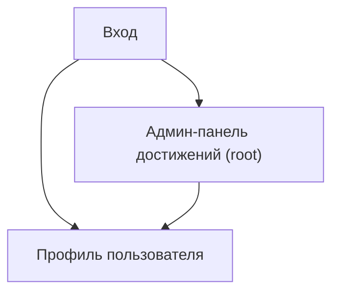

## 1. Product Overview
Функционал «Достижения» позволяет root-админу создавать/редактировать достижения (en обязателен; ru/uk опциональны с fallback на en + цвет), назначать их пользователям и показывать достижения-теги в профиле.
Цель: единый управляемый механизм бейджей/тегов, видимый в профиле.

## 2. Core Features

### 2.1 User Roles
| Role | Registration Method | Core Permissions |
|------|---------------------|------------------|
| Пользователь | Обычный логин (Supabase Auth) | Видит достижения (теги) в профиле; не управляет достижениями |
| Root | Выдаётся вручную (роль в системе) | Полный доступ: CRUD достижений, назначение/снятие достижений пользователям |

### 2.2 Feature Module
Наши требования состоят из следующих основных страниц:
1. **Вход**: аутентификация.
2. **Профиль пользователя**: отображение достижений как тегов.
3. **Админ-панель достижений (root)**: CRUD достижений + назначение достижений пользователям.

### 2.3 Page Details
| Page Name | Module Name | Feature description |
|-----------|-------------|------------------|
| Вход | Форма входа | Войти через Supabase Auth; показать ошибку при неуспехе |
| Профиль пользователя | Блок «Достижения» | Показать список достижений пользователя как теги (название по выбранному языку en/ru/uk; если ru/uk пусто — показывать en) + цвет |
| Админ-панель достижений (root) | Контроль доступа | Проверить root; при отсутствии прав скрыть/заблокировать доступ |
| Админ-панель достижений (root) | Справочник достижений (CRUD) | Создать/редактировать/удалить достижение: название en (обязательно), ru/uk (опционально), цвет |
| Админ-панель достижений (root) | Назначение достижений | Выбрать пользователя; назначить/снять достижения; увидеть текущие назначения |

## 3. Core Process
**User Flow**: пользователь входит → открывает профиль → видит достижения-теги (локализованные) рядом/под основными данными профиля.

**Root Flow**: root входит → открывает админ-панель достижений → управляет справочником достижений (CRUD) → выбирает пользователя → назначает/снимает достижения → изменения сразу видны в профиле.

