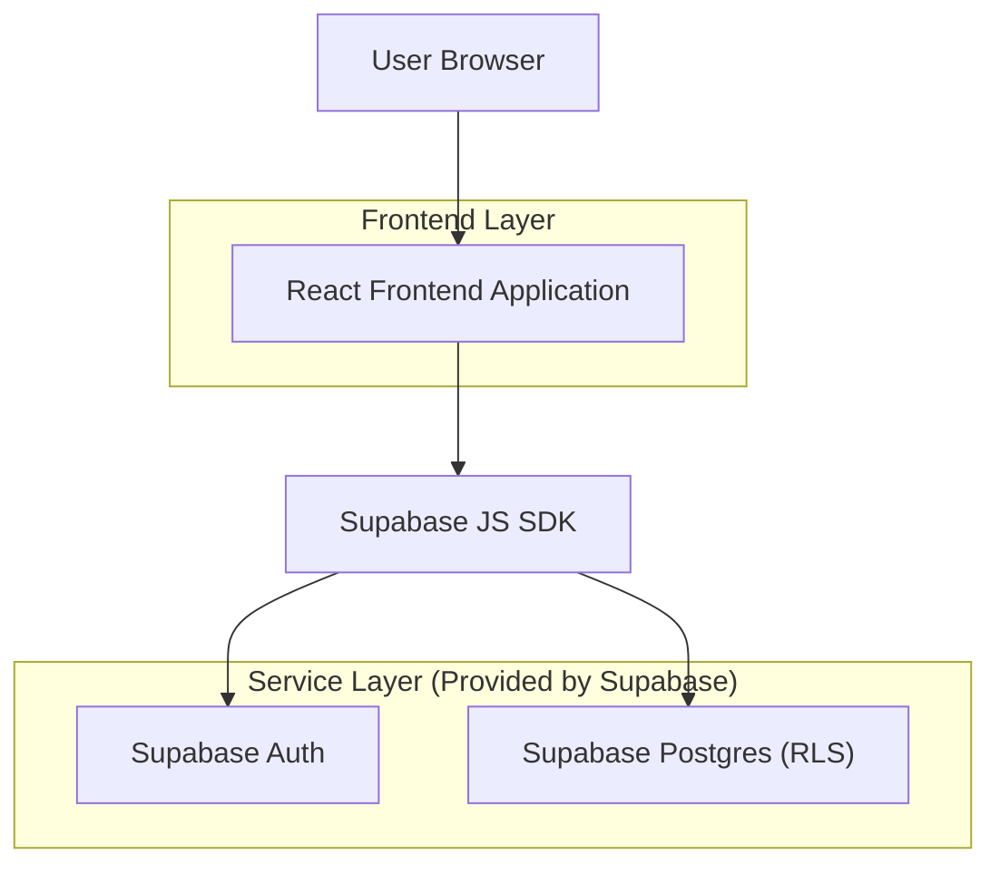
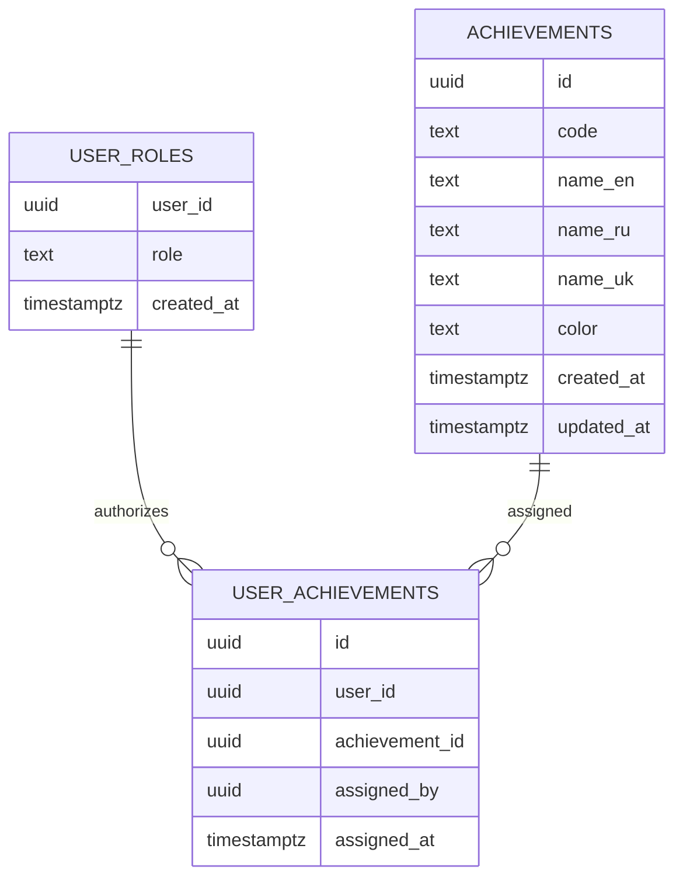

## 1.Architecture design


## 2.Technology Description
- Frontend: React@18 + TypeScript + vite + tailwindcss@3
- Backend: Supabase (Auth + Postgres + RLS)

## 3.Route definitions
| Route | Purpose |
|-------|---------|
| /login | Вход пользователя |
| /profile/:userId | Профиль, отображение достижений-тегов |
| /admin/achievements | Root-панель: CRUD достижений и назначение пользователям |

## 6.Data model(if applicable)

### 6.1 Data model definition


### 6.2 Data Definition Language
User roles (user_roles)
```sql
CREATE TABLE IF NOT EXISTS user_roles (
  user_id UUID PRIMARY KEY,
  role TEXT NOT NULL CHECK (role IN ('root')),
  created_at TIMESTAMPTZ NOT NULL DEFAULT now()
);
```

Achievements (achievements)
```sql
CREATE TABLE IF NOT EXISTS achievements (
  id UUID PRIMARY KEY DEFAULT gen_random_uuid(),
  code TEXT UNIQUE NOT NULL,
  name_en TEXT NOT NULL,
  name_ru TEXT,
  name_uk TEXT,
  color TEXT NOT NULL,
  created_at TIMESTAMPTZ NOT NULL DEFAULT now(),
  updated_at TIMESTAMPTZ NOT NULL DEFAULT now()
);
CREATE INDEX IF NOT EXISTS idx_achievements_code ON achievements (code);
```

User achievements (user_achievements)
```sql
CREATE TABLE IF NOT EXISTS user_achievements (
  id UUID PRIMARY KEY DEFAULT gen_random_uuid(),
  user_id UUID NOT NULL,
  achievement_id UUID NOT NULL,
  assigned_by UUID,
  assigned_at TIMESTAMPTZ NOT NULL DEFAULT now(),
  UNIQUE (user_id, achievement_id)
);
CREATE INDEX IF NOT EXISTS idx_user_ach_user_id ON user_achievements (user_id);
CREATE INDEX IF NOT EXISTS idx_user_ach_achievement_id ON user_achievements (achievement_id);
```

RLS + доступ root

Локализация (frontend правило)
- `name_en` обязателен.
- При отображении: если для текущего языка `name_ru`/`name_uk` пусто или NULL — показывать `name_en`.
```sql
ALTER TABLE achievements ENABLE ROW LEVEL SECURITY;
ALTER TABLE user_achievements ENABLE ROW LEVEL SECURITY;
ALTER TABLE user_roles ENABLE ROW LEVEL SECURITY;

-- SECURITY DEFINER helper (root определяется через user_roles)
CREATE OR REPLACE FUNCTION public.is_root()
RETURNS boolean
LANGUAGE sql
SECURITY DEFINER
SET search_path = public
AS $$
  SELECT EXISTS (
    SELECT 1 FROM public.user_roles ur
    WHERE ur.user_id = auth.uid() AND ur.role = 'root'
  );
$$;

-- Read: достижения доступны для отображения тегов
CREATE POLICY ach_read_all ON achievements
FOR SELECT TO anon, authenticated
USING (true);

-- Read: назначения достижений (для отображения в профиле)
CREATE POLICY ua_read_all ON user_achievements
FOR SELECT TO anon, authenticated
USING (true);

-- Write: управляет только root
CREATE POLICY ach_root_write ON achievements
FOR INSERT, UPDATE, DELETE TO authenticated
USING (public.is_root())
WITH CHECK (public.is_root());

CREATE POLICY ua_root_write ON user_achievements
FOR INSERT, UPDATE, DELETE TO authenticated
USING (public.is_root())
WITH CHECK (public.is_root());

-- user_roles читает только root (и сам root для проверки)
CREATE POLICY ur_root_read ON user_roles
FOR SELECT TO authenticated
USING (public.is_root() OR user_id = auth.uid());

CREATE POLICY ur_root_write ON user_roles
FOR INSERT, UPDATE, DELETE TO authenticated
USING (public.is_root())
WITH CHECK (public.is_root());

GRANT SELECT ON achievements TO anon;
GRANT SELECT ON user_achievements TO anon;
GRANT ALL PRIVILEGES ON achievements TO authenticated;
GRANT ALL PRIVILEGES ON user_achievements TO authenticated;
GRANT ALL PRIVILEGES ON user_roles TO authenticated;
```

Примечание: первого root-пользователя нужно проставить вручную в `user_roles` (через SQL в Supabase), иначе админ-доступа ни у кого не будет.
