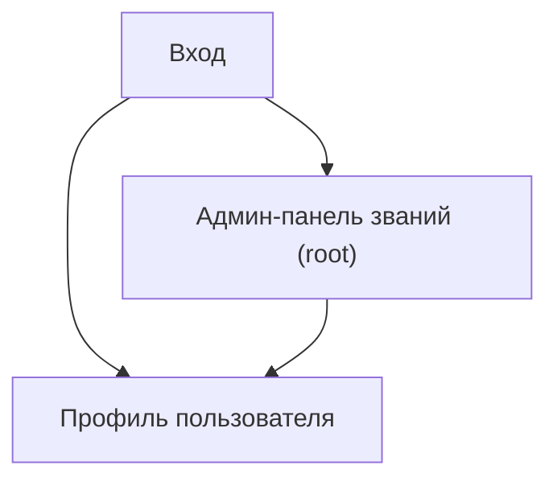

## 1. Product Overview
Функционал «Звания» позволяет root-админу вести справочник званий и назначать их пользователям.
Звания отображаются в профиле как теги; локализация: en обязателен, ru/uk — опциональны с fallback на en.

## 2. Core Features

### 2.1 User Roles
| Role | Registration Method | Core Permissions |
|------|---------------------|------------------|
| Пользователь | Обычный логин (Supabase Auth) | Видит звания (теги) в профиле; не управляет званиями |
| Root | Выдаётся вручную (роль в системе) | Полный доступ: CRUD званий, назначение/снятие званий пользователям |

### 2.2 Feature Module
Наши требования состоят из следующих основных страниц:
1. **Вход**: аутентификация.
2. **Профиль пользователя**: отображение званий как тегов.
3. **Админ-панель званий (root)**: CRUD званий + назначение званий пользователям.

### 2.3 Page Details
| Page Name | Module Name | Feature description |
|-----------|-------------|------------------|
| Вход | Форма входа | Войти через Supabase Auth; показать ошибку при неуспехе |
| Профиль пользователя | Блок «Звания» | Показать список званий пользователя как теги (название по выбранному языку en/ru/uk; если ru/uk пусто — показывать en) + цвет |
| Админ-панель званий (root) | Контроль доступа | Проверить root; при отсутствии прав скрыть/заблокировать доступ |
| Админ-панель званий (root) | Справочник званий (CRUD) | Создать/редактировать/удалить звание: code, название en (обязательно), ru/uk (опционально), цвет |
| Админ-панель званий (root) | Назначение званий | Выбрать пользователя; назначить/снять звания; увидеть текущие назначения |

## 3. Core Process
**User Flow**: пользователь входит → открывает профиль → видит звания-теги (локализованные с fallback на en) рядом/под основными данными профиля.

**Root Flow**: root входит → открывает админ-панель званий → управляет справочником (CRUD) → выбирает пользователя → назначает/снимает звания → изменения сразу видны в профиле.

