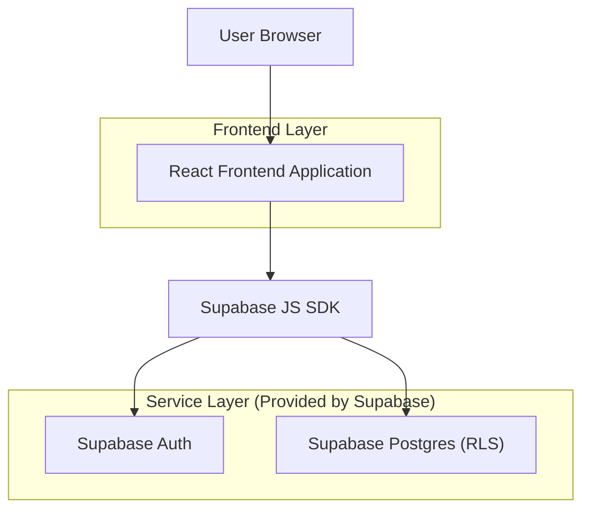
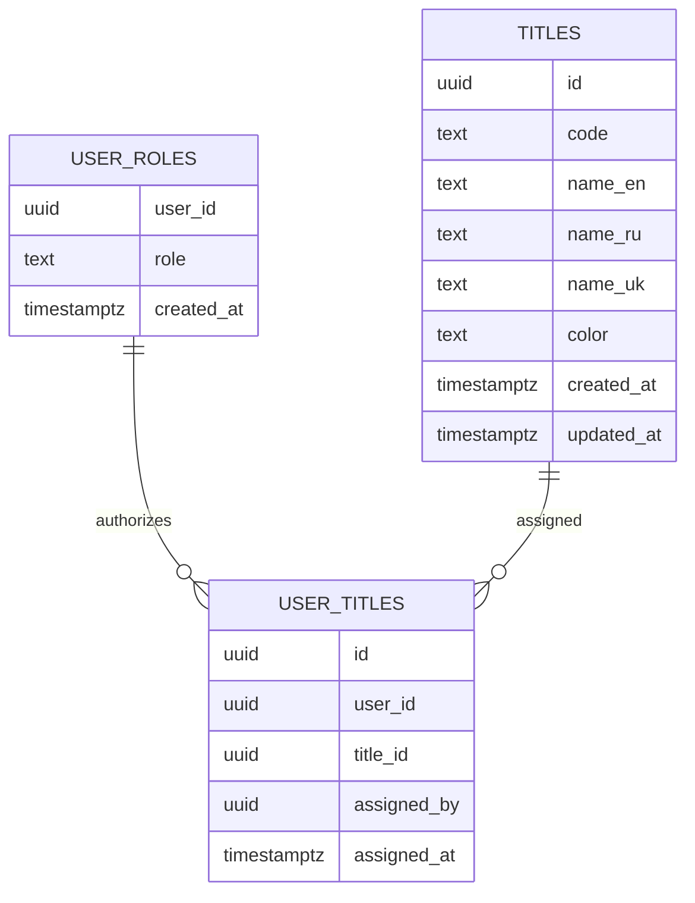

## 1.Architecture design


## 2.Technology Description
- Frontend: React@18 + TypeScript + vite + tailwindcss@3
- Backend: Supabase (Auth + Postgres + RLS)

## 3.Route definitions
| Route | Purpose |
|-------|---------|
| /login | Вход пользователя |
| /profile/:userId | Профиль, отображение званий-тегов |
| /admin/titles | Root-панель: CRUD званий и назначение пользователям |

## 6.Data model(if applicable)

### 6.1 Data model definition


### 6.2 Data Definition Language
Titles (titles)
```sql
CREATE TABLE IF NOT EXISTS titles (
  id UUID PRIMARY KEY DEFAULT gen_random_uuid(),
  code TEXT UNIQUE NOT NULL,
  name_en TEXT NOT NULL,
  name_ru TEXT,
  name_uk TEXT,
  color TEXT NOT NULL,
  created_at TIMESTAMPTZ NOT NULL DEFAULT now(),
  updated_at TIMESTAMPTZ NOT NULL DEFAULT now()
);
CREATE INDEX IF NOT EXISTS idx_titles_code ON titles (code);
```

User titles (user_titles)
```sql
CREATE TABLE IF NOT EXISTS user_titles (
  id UUID PRIMARY KEY DEFAULT gen_random_uuid(),
  user_id UUID NOT NULL,
  title_id UUID NOT NULL,
  assigned_by UUID,
  assigned_at TIMESTAMPTZ NOT NULL DEFAULT now(),
  UNIQUE (user_id, title_id)
);
CREATE INDEX IF NOT EXISTS idx_user_titles_user_id ON user_titles (user_id);
CREATE INDEX IF NOT EXISTS idx_user_titles_title_id ON user_titles (title_id);
```

RLS + доступ root

Локализация (frontend правило)
- `name_en` обязателен.
- При отображении: если для текущего языка `name_ru`/`name_uk` пусто или NULL — показывать `name_en`.

```sql
ALTER TABLE titles ENABLE ROW LEVEL SECURITY;
ALTER TABLE user_titles ENABLE ROW LEVEL SECURITY;

-- Используем уже существующую функцию public.is_root() из модуля ролей.

-- Read: звания доступны для отображения тегов
CREATE POLICY titles_read_all ON titles
FOR SELECT TO anon, authenticated
USING (true);

-- Read: назначения званий (для отображения в профиле)
CREATE POLICY ut_read_all ON user_titles
FOR SELECT TO anon, authenticated
USING (true);

-- Write: управляет только root
CREATE POLICY titles_root_write ON titles
FOR INSERT, UPDATE, DELETE TO authenticated
USING (public.is_root())
WITH CHECK (public.is_root());

CREATE POLICY ut_root_write ON user_titles
FOR INSERT, UPDATE, DELETE TO authenticated
USING (public.is_root())
WITH CHECK (public.is_root());

GRANT SELECT ON titles TO anon;
GRANT SELECT ON user_titles TO anon;
GRANT ALL PRIVILEGES ON titles TO authenticated;
GRANT ALL PRIVILEGES ON user_titles TO authenticated;
```