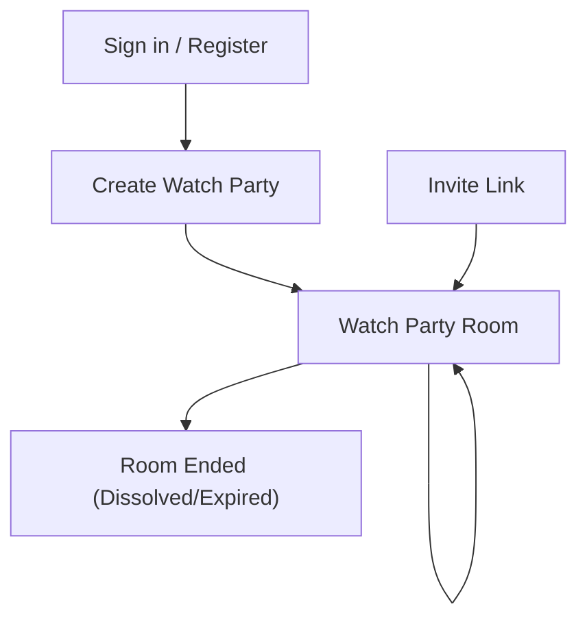

## 1. Product Overview
Watch Party Rooms let you watch the same content together in a shared room with synchronized playback, synchronized content selection, and real-time chat.
Only authenticated users can create rooms; participants join via invite links and follow room dissolve rules.

## 2. Core Features

### 2.1 User Roles
| Role | Registration Method | Core Permissions |
|------|---------------------|------------------|
| Authenticated User (Participant) | Sign in with existing site authentication | Join room via invite link; watch synced playback; chat; view participants; leave room |
| Room Owner (Creator) | Authenticated user creates a room | All Participant permissions; select content for the room; control playback (play/pause/seek/rate); generate/copy invite link; manually dissolve room |

### 2.2 Feature Module
Our Watch Party requirements consist of the following main pages:
1. **Create Watch Party**: content selection, room settings summary, create room.
2. **Watch Party Room**: synchronized player, synchronized content selection display, real-time chat, participant list/roles, invite link sharing, room lifecycle (leave/dissolve/expired).
3. **Sign in / Register (existing)**: authenticate before creating a room (and to fully participate).

### 2.3 Page Details
| Page Name | Module Name | Feature description |
|-----------|-------------|---------------------|
| Create Watch Party | Access control | Block unauthenticated users from creating; prompt sign-in and return after auth. |
| Create Watch Party | Content selection | Choose the content to watch (e.g., title/episode/source based on existing catalog); preview selection summary. |
| Create Watch Party | Room creation | Create a room as Owner; generate invite link; set room expiration (max 12h). |
| Watch Party Room | Room entry | Validate room is active and not expired/dissolved; join as Participant; show end-state if dissolved/expired. |
| Watch Party Room | Invite link | Display and copy shareable invite link; allow re-copy any time. |
| Watch Party Room | Participant list & roles | Show current participants; label the Owner; update list in real time. |
| Watch Party Room | Synchronized content selection | Display the current selected content; update instantly when Owner changes content. |
| Watch Party Room | Playback synchronization | Keep play/pause/seek/rate in sync across participants; resolve drift by applying periodic state corrections. |
| Watch Party Room | Owner playback controls | Allow Owner to play/pause/seek/change rate; broadcast changes to participants. |
| Watch Party Room | Real-time chat | Send and receive messages in real time; show message author and timestamp. |
| Watch Party Room | Leave & dissolve rules | Allow any participant to leave; allow Owner to manually dissolve; automatically dissolve when Owner leaves; automatically expire/dissolve at max 12h. |
| Sign in / Register (existing) | Authentication | Sign in/up to create a room; return to intended page after auth. |

## 3. Core Process
**Authenticated User (Participant) Flow**
1. Open an invite link.
2. If not signed in, sign in and return to the room.
3. Join the room and see the selected content, synchronized playback, participants list, and chat.
4. Watch while playback and content selection stay synchronized.
5. Send/receive chat messages.
6. Leave the room at any time.

**Room Owner Flow**
1. Sign in.
2. Go to “Create Watch Party”, select content, and create the room.
3. Share the invite link.
4. In the room, control playback (play/pause/seek/rate) and optionally switch the selected content.
5. End the room by manually dissolving it, or by leaving (which dissolves it automatically).
6. If the room reaches its maximum lifetime (12h), it expires/dissolves.

