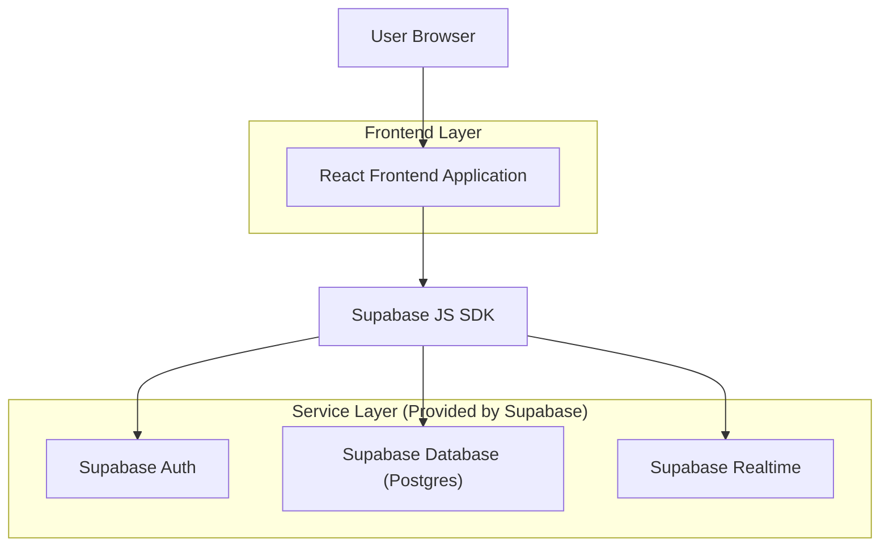
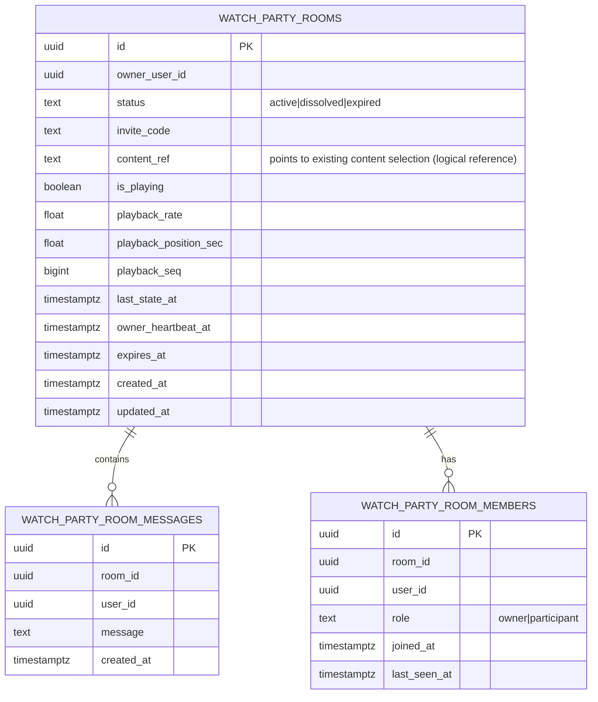

## 1.Architecture design


## 2.Technology Description
- Frontend: React@18 + tailwindcss@3 + vite
- Backend: Supabase (Auth + Postgres + Realtime)

## 3.Route definitions
| Route | Purpose |
|-------|---------|
| /watch-party/new | Create a new Watch Party room (auth required) |
| /watch-party/:roomId | Main room experience (player + chat + participants + invite) |
| /watch-party/join/:inviteCode | Resolve invite code to a room and redirect to /watch-party/:roomId |
| /login | Sign in (existing) |

## 4.API definitions (If it includes backend services)
None (frontend uses Supabase SDK directly).

## 6.Data model(if applicable)

### 6.1 Data model definition


### 6.2 Data Definition Language
Watch Party Rooms (watch_party_rooms)
```
-- create table
CREATE TABLE watch_party_rooms (
  id UUID PRIMARY KEY DEFAULT gen_random_uuid(),
  owner_user_id UUID NOT NULL,
  status TEXT NOT NULL DEFAULT 'active' CHECK (status IN ('active','dissolved','expired')),
  invite_code TEXT UNIQUE NOT NULL,

  -- synchronized content selection (logical reference into your existing catalog)
  content_ref TEXT NULL,

  -- synchronized playback state (authoritative state)
  is_playing BOOLEAN NOT NULL DEFAULT false,
  playback_rate REAL NOT NULL DEFAULT 1.0,
  playback_position_sec REAL NOT NULL DEFAULT 0,
  playback_seq BIGINT NOT NULL DEFAULT 0,
  last_state_at TIMESTAMPTZ NOT NULL DEFAULT NOW(),

  -- room dissolve rules support
  owner_heartbeat_at TIMESTAMPTZ NOT NULL DEFAULT NOW(),
  expires_at TIMESTAMPTZ NOT NULL,

  created_at TIMESTAMPTZ NOT NULL DEFAULT NOW(),
  updated_at TIMESTAMPTZ NOT NULL DEFAULT NOW()
);

-- logical query helpers
CREATE INDEX idx_watch_party_rooms_owner ON watch_party_rooms(owner_user_id);
CREATE INDEX idx_watch_party_rooms_invite ON watch_party_rooms(invite_code);
CREATE INDEX idx_watch_party_rooms_status ON watch_party_rooms(status);
CREATE INDEX idx_watch_party_rooms_expires ON watch_party_rooms(expires_at);

-- grants (guideline)
GRANT SELECT ON watch_party_rooms TO anon;
GRANT ALL PRIVILEGES ON watch_party_rooms TO authenticated;
```

Room Members (watch_party_room_members)
```
CREATE TABLE watch_party_room_members (
  id UUID PRIMARY KEY DEFAULT gen_random_uuid(),
  room_id UUID NOT NULL,
  user_id UUID NOT NULL,
  role TEXT NOT NULL DEFAULT 'participant' CHECK (role IN ('owner','participant')),
  joined_at TIMESTAMPTZ NOT NULL DEFAULT NOW(),
  last_seen_at TIMESTAMPTZ NOT NULL DEFAULT NOW()
);

CREATE INDEX idx_wprm_room ON watch_party_room_members(room_id);
CREATE INDEX idx_wprm_user ON watch_party_room_members(user_id);

GRANT SELECT ON watch_party_room_members TO anon;
GRANT ALL PRIVILEGES ON watch_party_room_members TO authenticated;
```

Room Messages (watch_party_room_messages)
```
CREATE TABLE watch_party_room_messages (
  id UUID PRIMARY KEY DEFAULT gen_random_uuid(),
  room_id UUID NOT NULL,
  user_id UUID NOT NULL,
  message TEXT NOT NULL,
  created_at TIMESTAMPTZ NOT NULL DEFAULT NOW()
);

CREATE INDEX idx_wprmsg_room_created ON watch_party_room_messages(room_id, created_at DESC);

GRANT SELECT ON watch_party_room_messages TO anon;
GRANT ALL PRIVILEGES ON watch_party_room_messages TO authenticated;
```

RLS / permissions (high-level)
```
-- Enable RLS
ALTER TABLE watch_party_rooms ENABLE ROW LEVEL SECURITY;
ALTER TABLE watch_party_room_members ENABLE ROW LEVEL SECURITY;
ALTER TABLE watch_party_room_messages ENABLE ROW LEVEL SECURITY;

-- Rooms: authenticated can read active rooms (or rooms they are in); keep it minimal for MVP
-- Create: only authenticated can create rooms
CREATE POLICY rooms_insert_authenticated
ON watch_party_rooms FOR INSERT
TO authenticated
WITH CHECK (auth.uid() = owner_user_id);

-- Update playback/content/state: only owner can update authoritative sync fields
CREATE POLICY rooms_update_owner_only
ON watch_party_rooms FOR UPDATE
TO authenticated
USING (auth.uid() = owner_user_id)
WITH CHECK (auth.uid() = owner_user_id);

-- Dissolve/expire: allow owner to dissolve; allow any authenticated member to mark expired if time exceeded
-- (application-level enforcement; room UI should prevent other updates when ended)
CREATE POLICY rooms_expire_when_time_elapsed
ON watch_party_rooms FOR UPDATE
TO authenticated
USING (true)
WITH CHECK (
  (status IN ('expired','dissolved'))
  AND (NOW() > expires_at OR NOW() - owner_heartbeat_at > INTERVAL '30 seconds')
);

-- Members: users can insert themselves as member; owner can also insert themselves as owner
CREATE POLICY members_join_self
ON watch_party_room_members FOR INSERT
TO authenticated
WITH CHECK (auth.uid() = user_id);

-- Messages: users can post messages as themselves
CREATE POLICY messages_insert_self
ON watch_party_room_messages FOR INSERT
TO authenticated
WITH CHECK (auth.uid() = user_id);
```

Realtime strategy (implementation notes)
- Playback sync + content selection sync: publish events on a room-scoped Supabase Realtime channel (e.g., `watch_party_room:{roomId}`) for low-latency updates; persist the authoritative state in `watch_party_rooms` so late joiners can load current state.
- Drift control: participants apply incoming state if `playback_seq` is newer; periodically reconcile to the authoritative `watch_party_rooms` row (e.g., every 10–15s).
- Owner leaves rule: the owner client writes `owner_heartbeat_at` on an interval (e.g., every 10s). If participants observe heartbeat stale (e.g., >30s), they treat the room as dissolved/ended and the room can be marked ended via the time-elapsed policy above.
- Max 12h rule: set `expires_at = created_at + interval '12 hours'` at room creation; UI blocks entry/interaction once expired.
