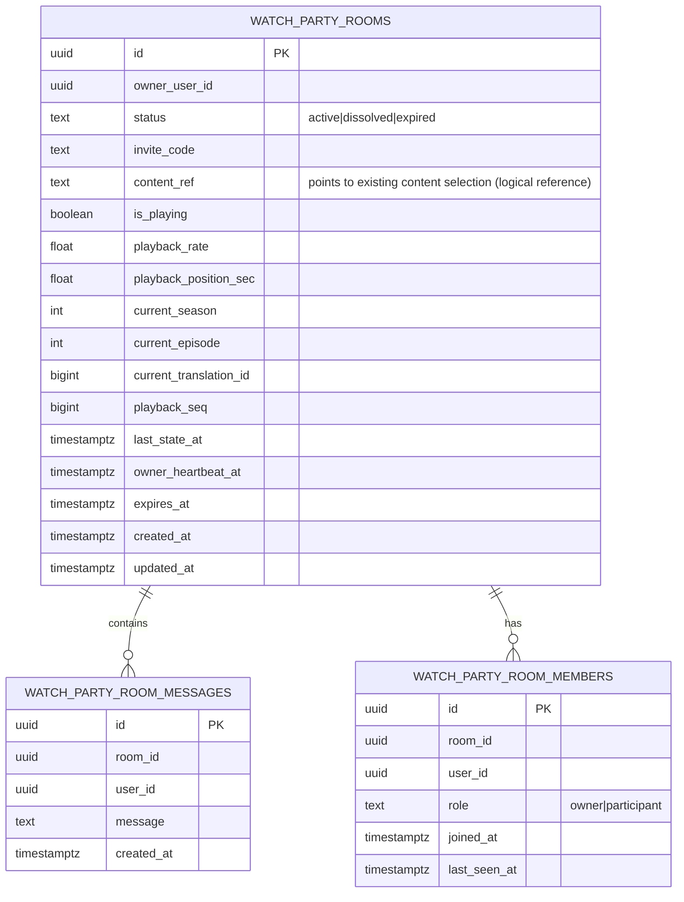

## 1. Architecture Design
```mermaid
graph TD
    A[User Browser] --> B[React Frontend (Next.js)]
    B --> C[WebSocket Server (Gin + WebSocket)]
    B --> D[Kodik iframe Player]
    D --> B[PostMessage API]
    C --> E[PostgreSQL Database]
    
    subgraph "Frontend Layer"
        B
        D
    end
    
    subgraph "Backend Layer"
        C
    end
    
    subgraph "Data Layer"
        E
    end
```

- Frontend: React@18 + TypeScript + TailwindCSS + Vanilla JS для работы с Kodik postMessage
- Initialization Tool: Next.js App Router
- Backend: Go + Gin + WebSocket (встроенная поддержка сокетов)
- Database: PostgreSQL

| Route | Purpose |
|-------|---------|
| /watch-party/new | Страница создания комнаты |
| /watch-party/join/[inviteCode] | Страница входа по инвайту |
| /watch-party/[roomId] | Основная страница комнаты с Kodik плеером, чатом и панелью участников |

## 4. Frontend Kodik Integration Code
```javascript
// Kodik Player Integration - фронтенд логика синхронизации
const kodikIframe = document.getElementById('kodik-player')?.contentWindow;
let isSuppressed = false; // Флаг для предотвращения эхо-событий
let lastServerTime = 0;
const DRIFT_THRESHOLD = 2.5; // Порог рассинхрона в секундах

// Обработчик сообщений от плеера
window.addEventListener('message', (e) => {
  if (!e.data?.key) return;
  
  // Не отправляем событие, если оно было вызвано нашей синхронной командой
  if (isSuppressed) {
    isSuppressed = false;
    return;
  }

  const { key, value } = e.data;
  if (canControl) { // Только владелец/модератор отправляет события
    switch(key) {
      case 'kodik_player_play':
        socket.send({ type: 'state_update', is_playing: true });
        break;
      case 'kodik_player_pause':
        socket.send({ type: 'state_update', is_playing: false });
        break;
      case 'kodik_player_seek':
        socket.send({ type: 'state_update', playback_position_sec: value.time });
        break;
      case 'kodik_player_current_episode':
        socket.send({ 
          type: 'episode_change',
          season: value.season,
          episode: value.episode,
          translation_id: value.translation.id
        });
        break;
      case 'kodik_player_speed_changenew':
        socket.send({ type: 'state_update', playback_rate: value.speed });
        break;
      case 'kodik_player_time_update': // Heartbeat каждую секунду
        if (Math.abs(value - lastServerTime) > DRIFT_THRESHOLD) {
          syncSeek(lastServerTime);
        }
        break;
    }
  }
});

// Обработчик сетевых команд от сервера
socket.onmessage = (event) => {
  const msg = JSON.parse(event.data);
  if (!kodikIframe) return;

  isSuppressed = true; // Включаем подавление чтобы не отправить эхо обратно
  switch(msg.type) {
    case 'state_update':
      lastServerTime = msg.playback_position_sec;
      if (msg.is_playing) {
        kodikIframe.postMessage({ key: 'kodik_player_api', value: { method: 'play' } }, '*');
      } else {
        kodikIframe.postMessage({ key: 'kodik_player_api', value: { method: 'pause' } }, '*');
      }
      kodikIframe.postMessage({ 
        key: 'kodik_player_api', 
        value: { method: 'speed', speed: msg.playback_rate } 
      }, '*');
      break;
    case 'episode_change':
      kodikIframe.postMessage({
        key: 'kodik_player_api',
        value: { method: 'change_episode', season: msg.season, episode: msg.episode }
      }, '*');
      break;
    case 'force_sync':
      syncSeek(msg.playback_position_sec);
      break;
  }
};

// Вспомогательная функция перемотки
function syncSeek(seconds) {
  if (!kodikIframe) return;
  isSuppressed = true;
  kodikIframe.postMessage({
    key: 'kodik_player_api',
    value: { method: 'seek', seconds: seconds }
  }, '*');
}

// Обход политики автоплея - кнопка "Войти в трансляцию"
document.getElementById('join-broadcast')?.addEventListener('click', () => {
  document.getElementById('autoplay-overlay').style.display = 'none';
  // Первый клик пользователя, теперь можно запустить плеер
  if (roomState.is_playing) {
    kodikIframe?.postMessage({ key: 'kodik_player_api', value: { method: 'play' } }, '*');
  }
});
```

## 5. Backend WebSocket Code
```go
// Бэкенд логика ретрансляции событий комнаты
func (wpHub *WatchPartyHub) broadcast(roomID int64, payload any) {
	wpHub.mu.Lock()
	clients, exists := wpHub.rooms[roomID]
	wpHub.mu.Unlock()
	if !exists {
		return
	}
	// Отправляем всем клиентам комнаты
	for _, client := range clients {
		client.send(payload)
	}
}

// Обработка входящих событий от клиентов
func (client *watchPartyClient) handleMessage(msg watchPartyInbound) {
	switch strings.ToLower(msg.Type) {
	case "state_update":
		if client.role != "owner" && client.role != "moderator" {
			return
		}
		// Обновляем состояние в БД
		updates := map[string]any{
			"is_playing":            *msg.IsPlaying,
			"playback_rate":         *msg.Rate,
			"playback_position_sec": *msg.PositionSec,
			"playback_seq":          client.room.PlaybackSeq + 1,
			"last_state_at":         time.Now(),
		}
		app.DB.Model(&models.WatchPartyRoom{}).Where("id = ?", client.roomID).Updates(updates)
		// Ретранслируем всем остальным
		wpHub.broadcast(client.roomID, gin.H{
			"type":                  "state_update",
			"is_playing":            *msg.IsPlaying,
			"playback_rate":         *msg.Rate,
			"playback_position_sec": *msg.PositionSec,
		})
	case "episode_change":
		// Ретранслируем смену эпизода всем клиентам
		wpHub.broadcast(client.roomID, gin.H{
			"type":     "episode_change",
			"season":   msg.Season,
			"episode":  msg.Episode,
		})
	}
}

// Heartbeat для периодической синхронизации времени
func (wpHub *WatchPartyHub) startHeartbeat() {
	ticker := time.NewTicker(3 * time.Second)
	defer ticker.Stop()
	for range ticker.C {
		wpHub.mu.Lock()
		for roomID, room := range wpHub.activeRooms {
			// Отправляем всем клиентам текущее время для проверки рассинхрона
			wpHub.broadcast(roomID, gin.H{
			"type":                  "force_sync",
			"playback_position_sec": room.PlaybackPosition,
			})
		}
		wpHub.mu.Unlock()
	}
}
```

## 6.Data model(if applicable)

### 6.1 Data model definition


### 6.2 Data Definition Language
Watch Party Rooms (watch_party_rooms)
```
-- create table
CREATE TABLE watch_party_rooms (
  id UUID PRIMARY KEY DEFAULT gen_random_uuid(),
  owner_user_id UUID NOT NULL,
  status TEXT NOT NULL DEFAULT 'active' CHECK (status IN ('active','dissolved','expired')),
  invite_code TEXT UNIQUE NOT NULL,

  -- synchronized content selection (logical reference into your existing catalog)
  content_ref TEXT NULL,

  -- synchronized playback state (authoritative state)
  is_playing BOOLEAN NOT NULL DEFAULT false,
  playback_rate REAL NOT NULL DEFAULT 1.0,
  playback_position_sec REAL NOT NULL DEFAULT 0,
  playback_seq BIGINT NOT NULL DEFAULT 0,
  last_state_at TIMESTAMPTZ NOT NULL DEFAULT NOW(),

  -- room dissolve rules support
  owner_heartbeat_at TIMESTAMPTZ NOT NULL DEFAULT NOW(),
  expires_at TIMESTAMPTZ NOT NULL,

  created_at TIMESTAMPTZ NOT NULL DEFAULT NOW(),
  updated_at TIMESTAMPTZ NOT NULL DEFAULT NOW()
);

-- logical query helpers
CREATE INDEX idx_watch_party_rooms_owner ON watch_party_rooms(owner_user_id);
CREATE INDEX idx_watch_party_rooms_invite ON watch_party_rooms(invite_code);
CREATE INDEX idx_watch_party_rooms_status ON watch_party_rooms(status);
CREATE INDEX idx_watch_party_rooms_expires ON watch_party_rooms(expires_at);

-- grants (guideline)
GRANT SELECT ON watch_party_rooms TO anon;
GRANT ALL PRIVILEGES ON watch_party_rooms TO authenticated;
```

Room Members (watch_party_room_members)
```
CREATE TABLE watch_party_room_members (
  id UUID PRIMARY KEY DEFAULT gen_random_uuid(),
  room_id UUID NOT NULL,
  user_id UUID NOT NULL,
  role TEXT NOT NULL DEFAULT 'participant' CHECK (role IN ('owner','participant')),
  joined_at TIMESTAMPTZ NOT NULL DEFAULT NOW(),
  last_seen_at TIMESTAMPTZ NOT NULL DEFAULT NOW()
);

CREATE INDEX idx_wprm_room ON watch_party_room_members(room_id);
CREATE INDEX idx_wprm_user ON watch_party_room_members(user_id);

GRANT SELECT ON watch_party_room_members TO anon;
GRANT ALL PRIVILEGES ON watch_party_room_members TO authenticated;
```

Room Messages (watch_party_room_messages)
```
CREATE TABLE watch_party_room_messages (
  id UUID PRIMARY KEY DEFAULT gen_random_uuid(),
  room_id UUID NOT NULL,
  user_id UUID NOT NULL,
  message TEXT NOT NULL,
  created_at TIMESTAMPTZ NOT NULL DEFAULT NOW()
);

CREATE INDEX idx_wprmsg_room_created ON watch_party_room_messages(room_id, created_at DESC);

GRANT SELECT ON watch_party_room_messages TO anon;
GRANT ALL PRIVILEGES ON watch_party_room_messages TO authenticated;
```

RLS / permissions (high-level)
```
-- Enable RLS
ALTER TABLE watch_party_rooms ENABLE ROW LEVEL SECURITY;
ALTER TABLE watch_party_room_members ENABLE ROW LEVEL SECURITY;
ALTER TABLE watch_party_room_messages ENABLE ROW LEVEL SECURITY;

-- Rooms: authenticated can read active rooms (or rooms they are in); keep it minimal for MVP
-- Create: only authenticated can create rooms
CREATE POLICY rooms_insert_authenticated
ON watch_party_rooms FOR INSERT
TO authenticated
WITH CHECK (auth.uid() = owner_user_id);

-- Update playback/content/state: only owner can update authoritative sync fields
CREATE POLICY rooms_update_owner_only
ON watch_party_rooms FOR UPDATE
TO authenticated
USING (auth.uid() = owner_user_id)
WITH CHECK (auth.uid() = owner_user_id);

-- Dissolve/expire: allow owner to dissolve; allow any authenticated member to mark expired if time exceeded
-- (application-level enforcement; room UI should prevent other updates when ended)
CREATE POLICY rooms_expire_when_time_elapsed
ON watch_party_rooms FOR UPDATE
TO authenticated
USING (true)
WITH CHECK (
  (status IN ('expired','dissolved'))
  AND (NOW() > expires_at OR NOW() - owner_heartbeat_at > INTERVAL '30 seconds')
);

-- Members: users can insert themselves as member; owner can also insert themselves as owner
CREATE POLICY members_join_self
ON watch_party_room_members FOR INSERT
TO authenticated
WITH CHECK (auth.uid() = user_id);

-- Messages: users can post messages as themselves
CREATE POLICY messages_insert_self
ON watch_party_room_messages FOR INSERT
TO authenticated
WITH CHECK (auth.uid() = user_id);
```

Realtime strategy (implementation notes)
- Playback sync + content selection sync: publish events on a room-scoped Supabase Realtime channel (e.g., `watch_party_room:{roomId}`) for low-latency updates; persist the authoritative state in `watch_party_rooms` so late joiners can load current state.
- Drift control: participants apply incoming state if `playback_seq` is newer; periodically reconcile to the authoritative `watch_party_rooms` row (e.g., every 10–15s).
- Owner leaves rule: the owner client writes `owner_heartbeat_at` on an interval (e.g., every 10s). If participants observe heartbeat stale (e.g., >30s), they treat the room as dissolved/ended and the room can be marked ended via the time-elapsed policy above.
- Max 12h rule: set `expires_at = created_at + interval '12 hours'` at room creation; UI blocks entry/interaction once expired.
